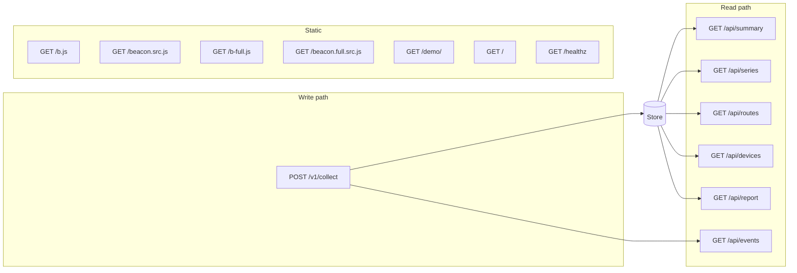

# HTTP API

Every endpoint the binary serves. Responses are hand-shaped JSON. There is no
content negotiation, no versioning beyond the collection path, and no
pagination.

---

## 1. Endpoint summary

| Method | Path | Purpose |
|---|---|---|
| `POST` | `/v1/collect` | Beacon collection |
| `GET` | `/api/summary` | p75 and band per metric, plus ingest counters |
| `GET` | `/api/series` | One metric bucketed over time |
| `GET` | `/api/routes` | One metric broken down by route |
| `GET` | `/api/devices` | One metric broken down by device class |
| `GET` | `/api/journeys` | One visitor's page sequence, most recently active first |
| `GET` | `/api/report` | Every metric at once, with quantiles, band counts, and breakdowns |
| `GET` | `/api/events` | Server-Sent Events: one notification per recorded measurement |
| `GET` | `/b.js` | The minified beacon, 942 bytes |
| `GET` | `/beacon.src.js` | The readable beacon source |
| `GET` | `/b-full.js` | The minified full beacon, 2,656 bytes |
| `GET` | `/beacon.full.src.js` | The readable full beacon source |
| `GET` | `/demo/` | The bundled demo site |
| `GET` | `/healthz` | Liveness check, returns `ok` |
| `GET` | `/` | The dashboard |



## 2. Collection

### `POST /v1/collect`

Accepts one beacon payload as `text/plain`, which is what `sendBeacon` sends by
default and what keeps the request CORS-simple.

**Always responds `204 No Content`,** whether the payload was stored or
rejected. A beacon cannot act on an error, and returning `4xx` to `sendBeacon`
fills the visitor's console while still losing the sample. Rejections are
counted and surfaced in `/api/summary` instead. The only other status is `405`
for a non-`POST` method.

**Always responds `429 Too Many Requests`** when the source has spent its
allowance, which is the one exception to the rule above. The check runs before
the body is read, so a source over its limit costs one map lookup rather than a
buffered read and a parse. Nothing in the beacon retries, so the status is for
the operator and any proxy in front, not for the page.

The limit is a token bucket per client address: **5 payloads per second with a
burst of 40** by default, set with `-rate` and `-burst`, and disabled with a
negative `-rate`. One page view produces one payload, so a real visitor spends
burst rather than rate even with ten tabs open. Forwarded headers are ignored
when identifying the source, for the same reason they are ignored for the
session id: they are trivially spoofed. Behind a reverse proxy every visitor
therefore shares one bucket, which is a documented limitation; run with a
negative `-rate` and limit at the proxy instead.

**Validation applied, in order:**

| Rule | Limit | On breach |
|---|---|---|
| Rate, per source address | 5/s, burst 40 | `429`, counted as `rateLimited` |
| Body size | 4096 bytes | Counted as `tooLarge` |
| Well-formed payload | One JSON object | Counted as `malformed` |
| Route present | Non-empty after sanitising | Counted as `malformed` |
| At least one known metric | | Counted as `malformed` |
| Metric keys | `lcp`, `inp`, `cls`, `fcp`, `ttfb` | Unknown keys dropped |
| Metric values | Finite, non-negative | Dropped |
| Plausible range | 600,000 for durations; 100 for CLS | Dropped |
| Metric key count | 32 | Counted as `malformed` |
| Route length | 512 bytes, truncated on a rune boundary | Truncated |
| Viewport width | 0 to 65535 | Ignored outside range |
| Page-view id `i` | Lowercase base-36, 32 bytes | Dropped, payload still stored |
| Duplicate `i` | Last 4096 identifiers seen | Counted as `duplicate`, not stored |
| Navigation type `n` | One of six known values | Dropped, payload still stored |
| Attribution keys | `lcp`, `inp`, `cls`, `fcp`, `ttfb` | Unknown keys dropped |
| Attribution key count | 8 | Counted as `malformed` |
| Attribution value type | Must be a JSON string | Counted as `malformed` |
| Attribution value | Control characters removed, invalid UTF-8 replaced, capped at 128 bytes | Cleaned; an empty result is dropped |

The route has its query string and fragment stripped before storage.

`i`, `n`, and `a` are optional and only the full beacon at `/b-full.js` sends
them. The six accepted navigation types are `navigate`, `reload`,
`back_forward`, `prerender`, `back-forward-cache`, and `soft-navigation`; the
first four come from the browser's navigation entry and the last two are the
beacon's own labels for a page view no navigation entry describes.

An attribution value is the only free-form string in the payload that reaches
the dashboard, so it is the field a hostile client would aim at. It is cleaned
rather than rejected, and the dashboard renders it with `textContent`, never
`innerHTML`. Angle brackets are deliberately preserved: mangling them would make
a legitimate selector unrecognisable without making an illegitimate one any
safer.

## 3. Query parameters

Shared by all five read endpoints.

| Parameter | Meaning | Default |
|---|---|---|
| `from` | Start of the window | 24 hours before `to` |
| `to` | End of the window, exclusive | Now |
| `metric` | One of `lcp`, `inp`, `cls`, `fcp`, `ttfb`, case-insensitive | `lcp` |
| `p` | Percentile to report: `50`, `75`, `90`, or `95` | `75` |
| `n` | Bucket count, `series` only, 1 to 720 | 48 |
| `route` | Restrict every figure to one route, matched exactly | unset |

`p` is a whole percentage, not a fraction: `p=90`, never `p=0.9`. The set is
closed rather than free-form. A histogram cannot answer a quantile more finely
than its buckets, and accepting `p=99.9` would invite reading a precision out of
the answer that is not in the data.

`route` matches the stored path exactly and is served from the store's route
index, so the other routes are not scanned. Prefix or substring matching is not
offered: it would quietly merge two pages into one figure. A route with no
samples in the window returns an empty result, not `404`. A page can stop being
visited, and that is data rather than an error.

`from` and `to` each accept three forms:

- **Epoch milliseconds**, for example `1756555200000`. Values below
  1,000,000,000,000 are rejected as implausible.
- **RFC 3339**, for example `2026-08-30T06:00:00Z`.
- **A relative duration** carrying a unit, for example `24h`, `90m`, `-6h`.
  Positive and negative both mean that far in the past.

A bare number without a unit is never interpreted as a duration. `24` returns an
error rather than a guess, because resolving the ambiguity silently would produce
a window that is wrong without indicating so.

Anything unparseable returns `400` with a JSON body naming the parameter:

```json
{ "error": "from: \"yesterday\" is not epoch milliseconds, RFC 3339, or a duration" }
```

All read responses are sent with `Cache-Control: no-store`.

Static assets carry an ETag and are conditional-request friendly. The beacon and
the demo site are cached for an hour; the dashboard's own `dash.js`, `dash.css`,
and `snapshot.js` are sent `no-cache`, so a browser revalidates them and a 304
costs one small request. Their names carry no content hash, and an hour of
unrevalidated caching means a corrected script that an open dashboard will not
pick up until the hour is out.

## 4. `GET /api/summary`

```json
{
  "from": "2026-08-29T12:00:00Z",
  "to": "2026-08-30T12:00:00Z",
  "samples": 1284,
  "percentile": 0.75,
  "metrics": [
    {
      "metric": "lcp",
      "value": 1834.2,
      "band": "good",
      "samples": 1284,
      "previous": 2260.8,
      "previousSamples": 1190,
      "good": 2500,
      "needsImprovement": 4000,
      "unit": "ms"
    }
  ],
  "ingest": { "accepted": 1284, "duplicate": 2, "rateLimited": 0, "malformed": 3, "tooLarge": 0, "storeErrors": 0 },
  "compared": { "from": "2026-08-28T12:00:00Z", "to": "2026-08-29T12:00:00Z", "samples": 1190 },
  "coverage": { "total": 5012, "oldest": "2026-08-25T09:14:02Z", "newest": "2026-08-30T11:58:41Z" },
  "beaconBytes": 942
}
```

`value` is the figure at the requested percentile. The field is not called `p75`
because the percentile is selectable, and a key named `p75` holding a p90 would
be wrong in every consumer that reads it. `percentile` echoes what was asked for,
as a fraction.

`value` is `null` and `band` is `""` when no samples were collected for that
metric. This is deliberate: an unreported metric must not render as zero, which
would present as a perfect score.

`previous` is the same metric at the same percentile over the window immediately
before this one, of equal length, and `compared` names that window. It is `null`
when the earlier window holds no samples for the metric, which is why
`previousSamples` ships beside it: a comparison against four page views is not a
trend. The route filter applies to both windows.

Metrics are returned in dashboard display order: LCP, INP, CLS, FCP, TTFB.
Thresholds ship with each entry so the dashboard need not duplicate the
constants. `unit` is `"ms"` for durations and `""` for CLS, which is unitless.

`coverage` describes the whole store rather than the window, so a caller can
distinguish an empty window from an empty database. It also reports the disk
footprint: `bytes` and `files` are measured by reading the day logs, not
estimated, `bytesPerRecord` is their average cost including the JSON keys, and
`retentionDays` is the `-retain` window the server was started with, `0` when
nothing is dropped. `beaconBytes` is included so
the dashboard can report the beacon's size without spending a request on it.

## 5. `GET /api/series`

```json
{
  "metric": "lcp",
  "from": "2026-08-29T12:00:00Z",
  "to": "2026-08-30T12:00:00Z",
  "bucketSeconds": 1800,
  "good": 2500,
  "needsImprovement": 4000,
  "unit": "ms",
  "buckets": [
    { "t": "2026-08-29T12:00:00Z", "value": 1802.4, "band": "good", "samples": 41 },
    { "t": "2026-08-29T12:30:00Z", "value": null, "band": "", "samples": 0 }
  ]
}
```

Buckets are evenly spaced and always returned in full, including empty ones. An
empty bucket carries `null` rather than zero, and the dashboard breaks its line
there rather than interpolating a value nobody measured.

Returns `400` if `to` is not after `from`, or if the range is too short to
divide into the requested number of buckets.

## 6. `GET /api/routes` and `GET /api/devices`

Identical shape. `routes` groups by request path; `devices` groups by device
class derived from viewport width: `mobile` at 767px and below, `tablet` to
1023px, `desktop` above that, and `unknown` when no width was reported.

```json
{
  "metric": "lcp",
  "from": "2026-08-29T12:00:00Z",
  "to": "2026-08-30T12:00:00Z",
  "good": 2500,
  "needsImprovement": 4000,
  "unit": "ms",
  "rows": [
    { "key": "/pricing", "value": 6100, "band": "poor", "samples": 88 },
    { "key": "/", "value": 1834.2, "band": "good", "samples": 940 }
  ]
}
```

Rows are sorted worst first, since the purpose of a breakdown is to identify the
slowest page. Ties are broken by key so ordering is stable between requests. Rows
without a value sort last.

## 7. `GET /api/report`

One document holding every figure the dashboard shows, for all five metrics at
once, so a window can be copied out of the browser or fetched by a script
without issuing five requests and stitching them together. The dashboard's
export buttons read this endpoint.

It takes the same `from`, `to`, `p`, and `route` parameters as the rest of the
read path, and ignores `metric` and `n`. `quantiles` always carries p50, p75,
p90, and p95 whatever `p` asks for; `p` selects only which one `band` rates.

```json
{
  "generated": "2026-08-30T12:00:00Z",
  "from": "2026-08-29T12:00:00Z",
  "to": "2026-08-30T12:00:00Z",
  "windowHours": 24,
  "headlinePercentile": 0.75,
  "pageViews": 1028,
  "metrics": [
    {
      "metric": "lcp",
      "name": "Largest Contentful Paint",
      "unit": "ms",
      "samples": 1012,
      "band": "needs-improvement",
      "quantiles": { "p50": 1834.2, "p75": 3210.5, "p90": 5800, "p95": 6100 },
      "min": 402,
      "max": 9800,
      "mean": 2233.9,
      "good": 2500,
      "needsImprovement": 4000,
      "distribution": { "good": 701, "needsImprovement": 210, "poor": 101 },
      "relativeError": 0.0488,
      "absoluteError": 0,
      "worstRoutes": [
        { "key": "/pricing", "value": 6100, "band": "poor", "samples": 88 }
      ],
      "worstDevices": [
        { "key": "mobile", "value": 4900, "band": "poor", "samples": 402 }
      ],
      "offenders": [
        { "selector": "img.hero", "samples": 88, "poor": 71 }
      ]
    }
  ],
  "ingest": { "accepted": 1028, "duplicate": 2, "rateLimited": 0, "malformed": 0, "tooLarge": 0, "storeErrors": 0 },
  "navigation": [
    { "type": "navigate", "samples": 902 },
    { "type": "soft-navigation", "samples": 126 }
  ],
  "coverage": { "total": 4102, "oldest": "2026-08-24T09:11:02Z", "newest": "2026-08-30T11:58:44Z" },
  "beaconBytes": 942,
  "caveats": ["Percentiles are approximate. ..."]
}
```

Notes on the fields that are not in the other endpoints:

- `distribution` counts are **exact**. They are tallied per record against the
  published thresholds during the scan, not read off histogram buckets, whose
  edges do not line up with a threshold. Everything in `quantiles` is
  approximate in the usual way.
- `worstRoutes` and `worstDevices` are capped at **five rows each**, worst
  first. A site with a thousand routes must not produce a thousand rows in a
  document meant to be read or pasted into a context window. The cap affects
  only these lists; `samples` and `distribution` still count every record.
- `min`, `max`, `mean`, and the `quantiles` map are absent when a metric has no
  samples in the window, and `band` is an empty string. An absent metric was
  not measured, which is not the same as being fast.
- `offenders` names the elements blamed for that metric, ranked by how many of
  the page views naming them were rated poor and then by how often they were
  named at all. Ranking on the poor count is what makes the list useful: the
  element named on every page view is usually the hero image, and it is only
  interesting when the pages carrying it are slow. Capped at five rows like the
  other breakdowns. It is `null` for a metric no record attributed, which is
  every metric on a site running only `/b.js`.
- `navigation` counts how the page views in the window began, most common first,
  and is `null` when no record carried a type. Like `offenders` it is populated
  only by `/b-full.js`.
- `caveats` restates the dashboard's footnotes inside the payload, so a report
  that travels somewhere else takes its disclosures with it.

## 7a. `GET /api/journeys`

One visitor's page views in the order they happened, most recently active
visitor first.

Every other endpoint reads across an aggregate and answers "how fast is this
route". This one reads along a single visitor and answers "what did one person
actually get, in order", which is a question a percentile cannot express. A p75
of 2.4s says nothing about whether one visitor hit three progressively slower
pages in a row; this says exactly that.

Parameters: the shared `from`, `to` and `route`, plus `n` for how many visitors
to return, 1 to 50, default 8. A `route` filter narrows each journey to that
route and drops visitors who never reached it.

```json
{
  "from": "2026-08-30T12:00:00Z",
  "to": "2026-08-30T13:00:00Z",
  "visitors": 42,
  "limit": 8,
  "journeys": [
    {
      "session": "6dc1a67e",
      "steps": [
        {
          "t": "2026-08-30T12:04:11Z",
          "route": "/",
          "values": { "lcp": 900, "cls": 0.02 },
          "bands": { "lcp": "good", "cls": "good" },
          "worst": "good",
          "device": "desktop"
        },
        {
          "t": "2026-08-30T12:05:02Z",
          "route": "/checkout",
          "values": { "lcp": 8200 },
          "bands": { "lcp": "poor" },
          "worst": "poor",
          "nav": "soft-navigation",
          "device": "desktop"
        }
      ],
      "pageViews": 2,
      "truncated": false,
      "durationSeconds": 51,
      "worst": "poor",
      "degraded": true
    }
  ],
  "note": "A visitor identifier is a truncated hash of ..."
}
```

- `session` is the coarse visitor identifier described under
  [`docs/architecture.md`](architecture.md): a truncated hash of the request
  origin, the user agent, and the current UTC date. It rotates at midnight UTC,
  is never stored in a cookie, and cannot be linked to the same person on
  another day. The `note` field carries that disclosure with the data, so a
  response read anywhere else still carries it.
- `degraded` is true when the last step is rated worse than the first. It is the
  reason this endpoint exists.
- `worst` on a step is the band of its worst-rated metric, and on a journey the
  worst band it reached anywhere. A step that reported nothing rateable ranks
  below `good` rather than above `poor`, so an empty page view never makes a
  journey look worse than it was.
- `steps` is capped at **25 per visitor**, oldest kept. `truncated` says so, and
  `pageViews` remains the real count.
- `visitors` counts every distinct visitor in the window, which is larger than
  the number of journeys returned whenever `n` truncated the list.

The same journeys appear in `GET /api/report`, but ranked worst first and cut to
three, because a report is meant to be read in one screen.

## 8. `GET /api/events`

A Server-Sent Events stream. One frame per recorded measurement:

```
: connected

event: sample
data: {"route":"/pricing","at":"2026-08-30T12:00:04.117Z"}

: keep-alive
```

The dashboard subscribes with `EventSource` and reloads its data when a frame
arrives, coalescing bursts into one reload every 1.5 seconds. An idle instance
costs one open connection and a comment line every 25 seconds; there is no
polling.

The frame carries the route and the timestamp and nothing else. Sending the
figures would mean a second code path computing them, which is a second thing
to keep correct, and the client already knows how to read the API. The route is
JSON-quoted, so a path containing a quote or a newline cannot forge a frame.

SSE rather than WebSocket: the traffic is one-directional and tiny, it is a text
format over an ordinary response that `net/http` already serves, and the browser
reconnects on its own. A WebSocket would mean hand-writing a handshake, framing,
and masking for a feature that sends one line per page view.

A subscriber that stops reading is never waited on. Its queue holds 8
notifications and then drops them: a notification carries nothing the client
cannot re-read, so a slow client should skip to the present rather than replay a
backlog. This matters because publishing happens on the goroutine answering the
beacon, and a stalled browser tab must not stall collection.

## 9. Accuracy

Every `value` in this API is an approximation read off histogram buckets, not an
exact order statistic. For millisecond metrics the error is bounded at **4.9%
relative**; for CLS it is **0.0025 absolute**. See
[`storage.md`](storage.md#3-percentiles) for the arithmetic.
