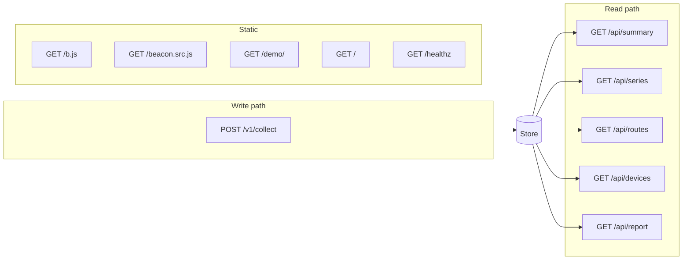

# HTTP API

Every endpoint the binary serves. Responses are hand-shaped JSON. There is no
content negotiation, no versioning beyond the collection path, and no
pagination.

---

## 1. Endpoint summary

| Method | Path | Purpose |
|---|---|---|
| `POST` | `/v1/collect` | Beacon collection |
| `GET` | `/api/summary` | p75 and band per metric, plus ingest counters |
| `GET` | `/api/series` | One metric bucketed over time |
| `GET` | `/api/routes` | One metric broken down by route |
| `GET` | `/api/devices` | One metric broken down by device class |
| `GET` | `/api/report` | Every metric at once, with quantiles, band counts, and breakdowns |
| `GET` | `/b.js` | The minified beacon |
| `GET` | `/beacon.src.js` | The readable beacon source |
| `GET` | `/demo/` | The bundled demo site |
| `GET` | `/healthz` | Liveness check, returns `ok` |
| `GET` | `/` | The dashboard |



## 2. Collection

### `POST /v1/collect`

Accepts one beacon payload as `text/plain`, which is what `sendBeacon` sends by
default and what keeps the request CORS-simple.

**Always responds `204 No Content`,** whether the payload was stored or
rejected. A beacon cannot act on an error, and returning `4xx` to `sendBeacon`
fills the visitor's console while still losing the sample. Rejections are
counted and surfaced in `/api/summary` instead. The only other status is `405`
for a non-`POST` method.

**Validation applied, in order:**

| Rule | Limit | On breach |
|---|---|---|
| Body size | 4096 bytes | Counted as `tooLarge` |
| Well-formed payload | One JSON object | Counted as `malformed` |
| Route present | Non-empty after sanitising | Counted as `malformed` |
| At least one known metric | | Counted as `malformed` |
| Metric keys | `lcp`, `inp`, `cls`, `fcp`, `ttfb` | Unknown keys dropped |
| Metric values | Finite, non-negative | Dropped |
| Plausible range | 600,000 for durations; 100 for CLS | Dropped |
| Metric key count | 32 | Counted as `malformed` |
| Route length | 512 bytes, truncated on a rune boundary | Truncated |
| Viewport width | 0 to 65535 | Ignored outside range |

The route has its query string and fragment stripped before storage.

## 3. Query parameters

Shared by all four read endpoints.

| Parameter | Meaning | Default |
|---|---|---|
| `from` | Start of the window | 24 hours before `to` |
| `to` | End of the window, exclusive | Now |
| `metric` | One of `lcp`, `inp`, `cls`, `fcp`, `ttfb`, case-insensitive | `lcp` |
| `n` | Bucket count, `series` only, 1 to 720 | 48 |

`from` and `to` each accept three forms:

- **Epoch milliseconds**, for example `1756555200000`. Values below
  1,000,000,000,000 are rejected as implausible.
- **RFC 3339**, for example `2026-08-30T06:00:00Z`.
- **A relative duration** carrying a unit, for example `24h`, `90m`, `-6h`.
  Positive and negative both mean that far in the past.

A bare number without a unit is never interpreted as a duration. `24` returns an
error rather than a guess, because resolving the ambiguity silently would produce
a window that is wrong without indicating so.

Anything unparseable returns `400` with a JSON body naming the parameter:

```json
{ "error": "from: \"yesterday\" is not epoch milliseconds, RFC 3339, or a duration" }
```

All read responses are sent with `Cache-Control: no-store`.

## 4. `GET /api/summary`

```json
{
  "from": "2026-08-29T12:00:00Z",
  "to": "2026-08-30T12:00:00Z",
  "samples": 1284,
  "metrics": [
    {
      "metric": "lcp",
      "p75": 1834.2,
      "band": "good",
      "samples": 1284,
      "good": 2500,
      "needsImprovement": 4000,
      "unit": "ms"
    }
  ],
  "ingest": { "accepted": 1284, "malformed": 3, "tooLarge": 0, "storeErrors": 0 },
  "coverage": { "total": 5012, "oldest": "2026-08-25T09:14:02Z", "newest": "2026-08-30T11:58:41Z" },
  "beaconBytes": 942
}
```

`p75` is `null` and `band` is `""` when no samples were collected for that
metric. This is deliberate: an unreported metric must not render as zero, which
would present as a perfect score.

Metrics are returned in dashboard display order: LCP, INP, CLS, FCP, TTFB.
Thresholds ship with each entry so the dashboard need not duplicate the
constants. `unit` is `"ms"` for durations and `""` for CLS, which is unitless.

`coverage` describes the whole store rather than the window, so a caller can
distinguish an empty window from an empty database. `beaconBytes` is included so
the dashboard can report the beacon's size without spending a request on it.

## 5. `GET /api/series`

```json
{
  "metric": "lcp",
  "from": "2026-08-29T12:00:00Z",
  "to": "2026-08-30T12:00:00Z",
  "bucketSeconds": 1800,
  "good": 2500,
  "needsImprovement": 4000,
  "unit": "ms",
  "buckets": [
    { "t": "2026-08-29T12:00:00Z", "p75": 1802.4, "band": "good", "samples": 41 },
    { "t": "2026-08-29T12:30:00Z", "p75": null, "band": "", "samples": 0 }
  ]
}
```

Buckets are evenly spaced and always returned in full, including empty ones. An
empty bucket carries `null` rather than zero, and the dashboard breaks its line
there rather than interpolating a value nobody measured.

Returns `400` if `to` is not after `from`, or if the range is too short to
divide into the requested number of buckets.

## 6. `GET /api/routes` and `GET /api/devices`

Identical shape. `routes` groups by request path; `devices` groups by device
class derived from viewport width: `mobile` at 767px and below, `tablet` to
1023px, `desktop` above that, and `unknown` when no width was reported.

```json
{
  "metric": "lcp",
  "from": "2026-08-29T12:00:00Z",
  "to": "2026-08-30T12:00:00Z",
  "good": 2500,
  "needsImprovement": 4000,
  "unit": "ms",
  "rows": [
    { "key": "/pricing", "p75": 6100, "band": "poor", "samples": 88 },
    { "key": "/", "p75": 1834.2, "band": "good", "samples": 940 }
  ]
}
```

Rows are sorted worst first, since the purpose of a breakdown is to identify the
slowest page. Ties are broken by key so ordering is stable between requests. Rows
without a value sort last.

## 7. `GET /api/report`

One document holding every figure the dashboard shows, for all five metrics at
once, so a window can be copied out of the browser or fetched by a script
without issuing five requests and stitching them together. The dashboard's
export buttons read this endpoint.

It takes the same `from` and `to` parameters as the rest of the read path, and
ignores `metric` and `n`.

```json
{
  "generated": "2026-08-30T12:00:00Z",
  "from": "2026-08-29T12:00:00Z",
  "to": "2026-08-30T12:00:00Z",
  "windowHours": 24,
  "headlinePercentile": 0.75,
  "pageViews": 1028,
  "metrics": [
    {
      "metric": "lcp",
      "name": "Largest Contentful Paint",
      "unit": "ms",
      "samples": 1012,
      "band": "needs-improvement",
      "quantiles": { "p50": 1834.2, "p75": 3210.5, "p90": 5800, "p95": 6100 },
      "min": 402,
      "max": 9800,
      "mean": 2233.9,
      "good": 2500,
      "needsImprovement": 4000,
      "distribution": { "good": 701, "needsImprovement": 210, "poor": 101 },
      "relativeError": 0.0488,
      "absoluteError": 0,
      "worstRoutes": [
        { "key": "/pricing", "p75": 6100, "band": "poor", "samples": 88 }
      ],
      "worstDevices": [
        { "key": "mobile", "p75": 4900, "band": "poor", "samples": 402 }
      ]
    }
  ],
  "ingest": { "accepted": 1028, "malformed": 0, "tooLarge": 0, "storeErrors": 0 },
  "coverage": { "total": 4102, "oldest": "2026-08-24T09:11:02Z", "newest": "2026-08-30T11:58:44Z" },
  "beaconBytes": 942,
  "caveats": ["Percentiles are approximate. ..."]
}
```

Notes on the fields that are not in the other endpoints:

- `distribution` counts are **exact**. They are tallied per record against the
  published thresholds during the scan, not read off histogram buckets, whose
  edges do not line up with a threshold. Everything in `quantiles` is
  approximate in the usual way.
- `worstRoutes` and `worstDevices` are capped at **five rows each**, worst
  first. A site with a thousand routes must not produce a thousand rows in a
  document meant to be read or pasted into a context window. The cap affects
  only these lists; `samples` and `distribution` still count every record.
- `min`, `max`, `mean`, and the `quantiles` map are absent when a metric has no
  samples in the window, and `band` is an empty string. An absent metric was
  not measured, which is not the same as being fast.
- `caveats` restates the dashboard's footnotes inside the payload, so a report
  that travels somewhere else takes its disclosures with it.

## 8. Accuracy

Every `p75` in this API is an approximation read off histogram buckets, not an
exact order statistic. For millisecond metrics the error is bounded at **4.9%
relative**; for CLS it is **0.0025 absolute**. See
[`storage.md`](storage.md#3-percentiles) for the arithmetic.
