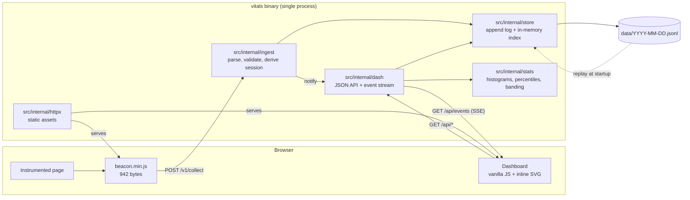
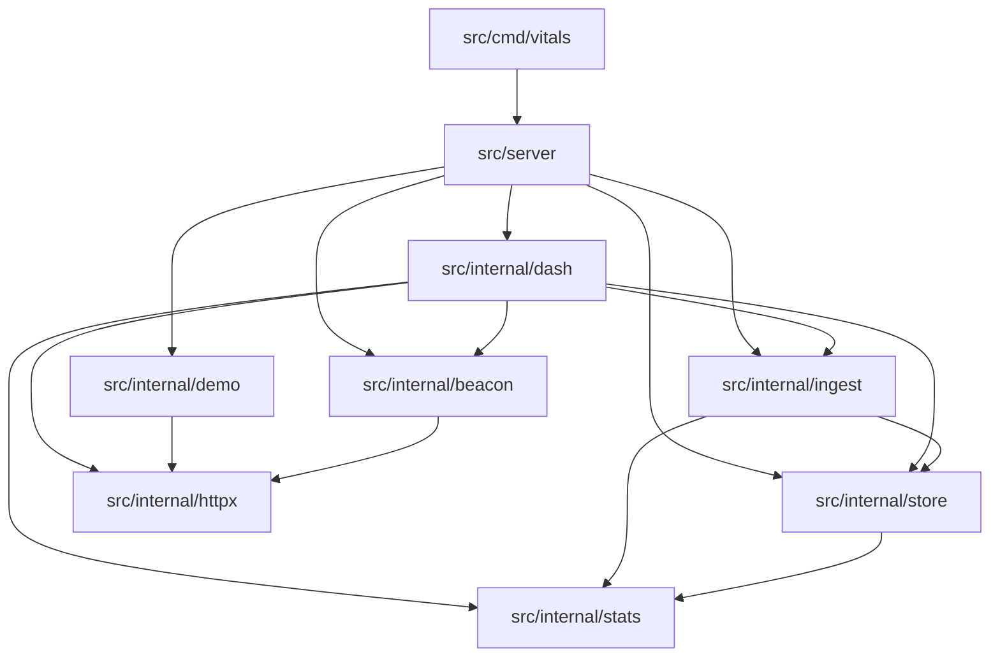
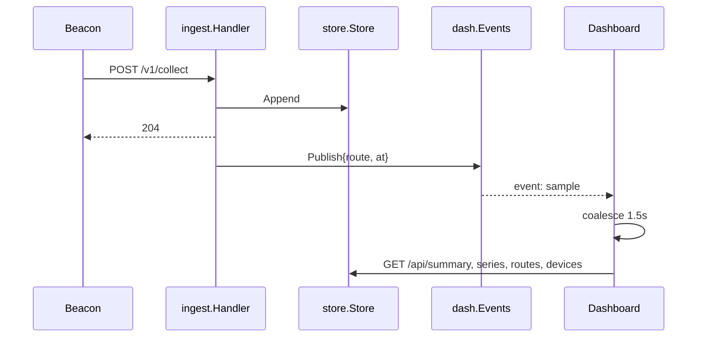
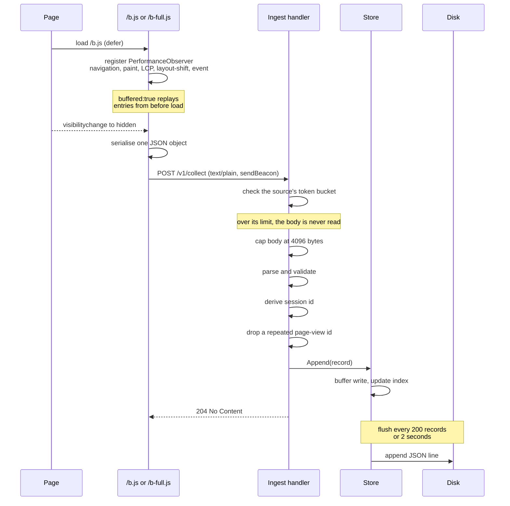
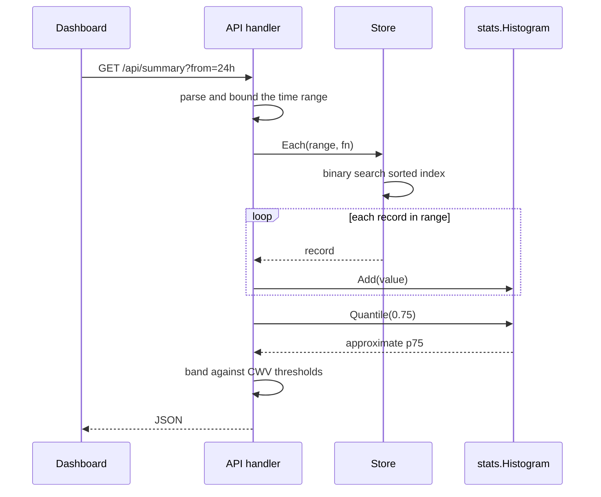
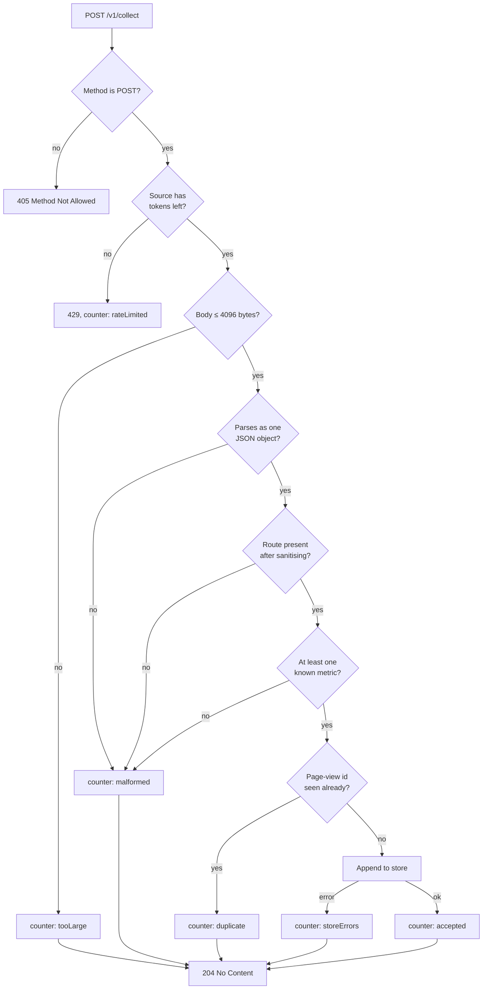

# Architecture

The structure of the system, the path a measurement takes through it, and the
constraints that follow from the design.

Related documents: [`beacon.md`](beacon.md) for the client script,
[`api.md`](api.md) for the HTTP surface, [`storage.md`](storage.md) for the
on-disk format and percentile arithmetic, and
[`development.md`](development.md) for the build and test process.

---

## 1. System overview

A single process serves the dashboard, the demo site, the beacon, the collection
endpoint, and the JSON API on one port. This is what allows the tool to run as
one command with no configuration file and no external services.

## 2. Package layout

| Package | Responsibility |
|---|---|
| `src/cmd/vitals` | Flags, graceful shutdown, logging |
| `src/server` | The module's only exported package: opens the store and builds the route table |
| `src/internal/httpx` | Static file serving: MIME, ETag, gzip, cache policy |
| `src/internal/beacon` | Client script, embedded and size-checked |
| `src/internal/ingest` | Payload parsing, validation, session derivation, per-source rate limiting, duplicate suppression, counters |
| `src/internal/store` | Append log, replay, in-memory indexes by time, route and session, range queries |
| `src/internal/stats` | Histograms, approximate percentiles, banding |
| `src/internal/dash` | JSON API handlers, the live event stream, and dashboard assets |
| `src/internal/demo` | Bundled demo site |
| `src/tools/` | Build-time utilities: dependency check, hashing, size reporting |
| `tests/` | Black-box tests over the served HTTP surface; see `tests/README.md` |

`src/server` exists so that a test, or an embedder, gets the routing the binary
serves rather than a second copy assembled for the occasion. Everything it
wires together stays under `src/internal`, which the compiler keeps private to
this module.

Dependencies run in one direction only:

`src/internal/stats` and `src/internal/httpx` are leaves and depend on nothing within
the project. There are no cycles.

Assets under `src/internal/beacon`, `src/internal/dash/assets`, and
`src/internal/demo/site` are embedded with `//go:embed`, making the binary
standalone. They reside inside the packages that embed them because `//go:embed`
cannot reference paths outside its own package directory.

## 2a. Live updates

A recorded measurement notifies every connected dashboard, which then re-reads
the API. The collector knows nothing about the dashboard: it calls a function it
was handed at wiring time in `src/server`.

Three properties this design holds to:

- **Publishing never blocks.** It runs on the goroutine answering the beacon. A
  subscriber that has fallen 8 notifications behind starts dropping them, which
  is correct for a signal meaning "re-read" and would be wrong for a message
  carrying data.
- **The frame carries no figures.** Route and timestamp only. Sending numbers
  would mean a second path computing them, and therefore a second path to keep
  correct.
- **Reloads are coalesced.** A burst of page views produces one reload per 1.5
  seconds, not one per view.

## 3. Collection path

The response is returned before the record reaches disk. Ingest never waits on
I/O.

## 4. Query path

## 5. Validation pipeline

Every rejection is counted rather than reported to the client.

Returning `204` for every rejected *payload* is deliberate. A beacon cannot act
on an error and will not retry usefully, and returning `4xx` to `sendBeacon`
fills the visitor's console while still losing the sample. Counters are exposed
through `/api/summary` and displayed on the dashboard, so rejections remain
visible to the operator.

The rate limit is the one exception, and it is a different kind of rejection:
`429` is aimed at the operator and at any proxy in front, not at the page, and
nothing in either beacon reads the status. It is checked before the body is
read, so a source over its limit costs one map lookup rather than a buffered
read and a parse. The bucket is 5 payloads per second with a burst of 40 per
client address, set with `-rate` and `-burst` and disabled with a negative
`-rate`.

Duplicate suppression is not validation and does not mean the payload was
wrong. The full beacon stamps each page view with an identifier so that a
payload sent twice, which the send-on-hide plus send-on-unload path can produce,
is stored once. The most recent 4096 identifiers are remembered.

## 6. Design decisions

**The server clock is authoritative.** The client timestamp is parsed and
range-checked but never used for storage. A visitor with an incorrect clock
would otherwise distribute records arbitrarily across the timeline.

**No CORS headers are set.** `sendBeacon` transmits `text/plain`, which
constitutes a CORS-simple request: the browser sends it cross-origin without a
preflight and never reads the response.

**Sessions are derived rather than stored.** The identifier is
`sha256(ip + user-agent + UTC date)` truncated to eight hexadecimal characters.
No cookie is set, no persistent identifier is issued, the IP address is never
written to disk, and the value rotates at midnight UTC, so a visitor cannot be
correlated across days.

**Device class is derived from viewport width.** User-agent parsing is
unreliable, is being progressively restricted by browsers, and would constitute
a fingerprinting surface. Breakpoints are 767px and 1023px.

## 7. Concurrency

The store is guarded by a `sync.RWMutex`. Appends hold the write lock only long
enough to buffer the record and update the index, never for the duration of a
disk write. A background goroutine flushes the buffer every two seconds.

Reads hold the read lock for the duration of iteration, so a callback passed to
`Each` must not re-enter the store.

Ingest counters use `atomic.Uint64`.

The rate limiter holds its own mutex, taken only for a map lookup and some
arithmetic. Buckets are refilled lazily from the elapsed time rather than by a
ticker, so an idle client costs one map entry and no goroutine. A sweep every
five minutes drops sources idle for ten, and the table is capped at 8192
sources with eviction of the least recently seen, so the defence cannot become
the exhaustion it defends against.

The event broadcaster has its own mutex, held only while walking the subscriber
set. Sends are non-blocking, so a stalled dashboard cannot delay the collector
that is publishing to it. A subscriber's cancel function is idempotent and is
the only place its channel is closed.

The suite runs under the race detector in CI on every push. It has not been run
under the race detector on Windows, where the detector requires a C toolchain.

## 8. Constraints of this design

The following are properties of the architecture rather than defects.

| Constraint | Consequence |
|---|---|
| Entire record set held in memory | Memory grows with total records; capacity is bounded by one machine |
| Single writer, no locking | Two processes sharing a data directory will corrupt the log |
| Retention is day-granular | `-retain` drops whole day logs; a record is never deleted on its own, and without the flag `data/` grows forever |
| No authentication | Dashboard and API are open to anyone who can reach the port |
| The rate limit is per client address | Forwarded headers are ignored because they are spoofable, so behind a reverse proxy every visitor shares one bucket |
| One event stream per dashboard | Connections scale with open tabs, not with traffic; each costs a goroutine and a keep-alive every 25s |
| Route and session are the only secondary indexes | A device-class query scans the range |
| No authentication on collection either | The rate limit bounds the damage from an unauthenticated writer; it does not prevent a determined one from inflating the numbers |

At the intended scale, a single site producing thousands of page views per day,
an append log with a sorted in-memory index is the appropriate design rather
than a compromise. It would not withstand deployment against a large site, and
is not intended to.
