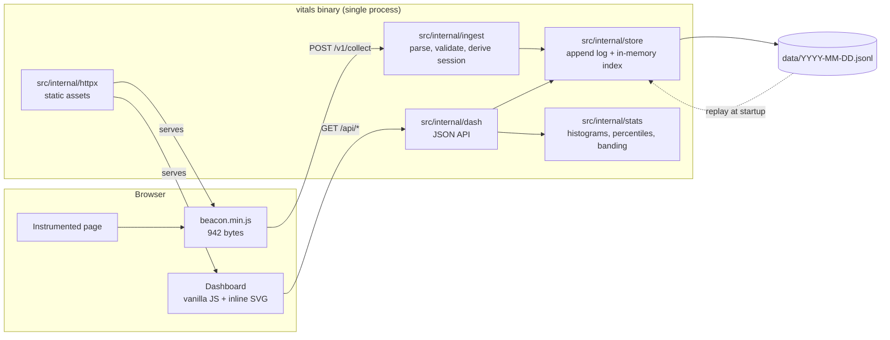
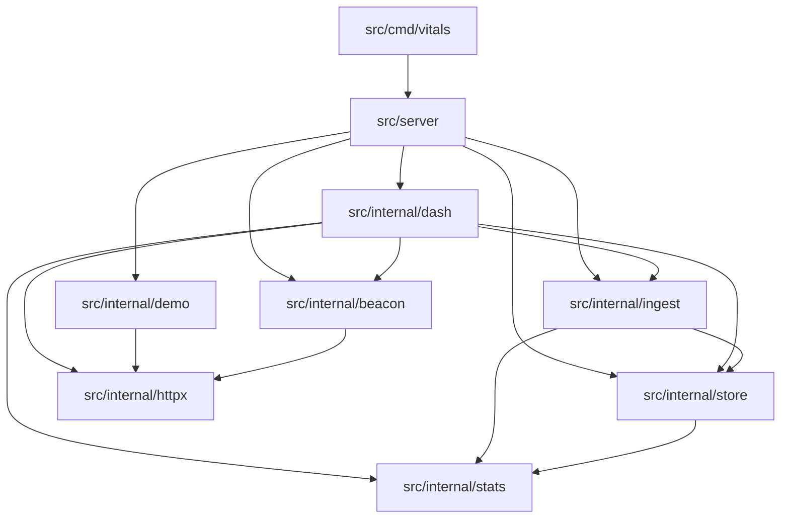
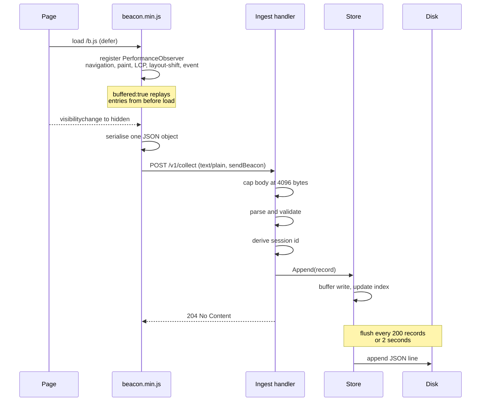
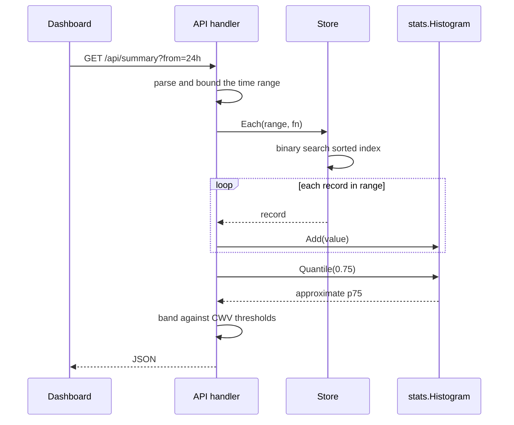
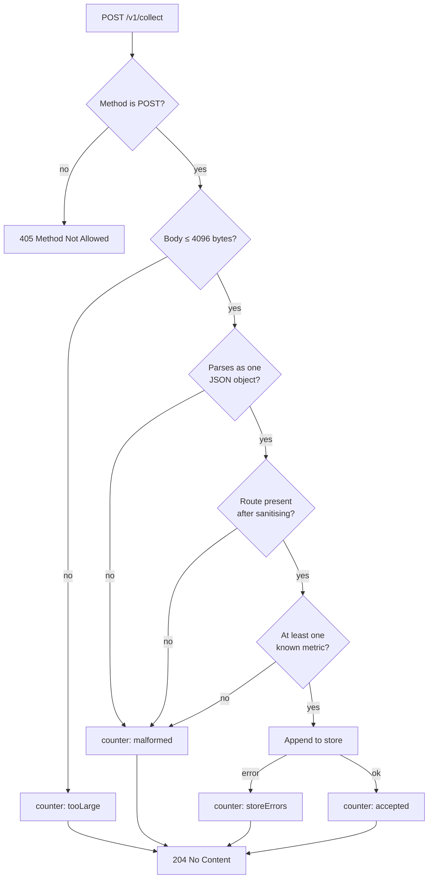

# Architecture

The structure of the system, the path a measurement takes through it, and the
constraints that follow from the design.

Related documents: [`beacon.md`](beacon.md) for the client script,
[`api.md`](api.md) for the HTTP surface, [`storage.md`](storage.md) for the
on-disk format and percentile arithmetic, and
[`development.md`](development.md) for the build and test process.

---

## 1. System overview

A single process serves the dashboard, the demo site, the beacon, the collection
endpoint, and the JSON API on one port. This is what allows the tool to run as
one command with no configuration file and no external services.

## 2. Package layout

| Package | Responsibility |
|---|---|
| `src/cmd/vitals` | Flags, graceful shutdown, logging |
| `src/server` | The module's only exported package: opens the store and builds the route table |
| `src/internal/httpx` | Static file serving: MIME, ETag, gzip, cache policy |
| `src/internal/beacon` | Client script, embedded and size-checked |
| `src/internal/ingest` | Payload parsing, validation, session derivation, counters |
| `src/internal/store` | Append log, replay, in-memory index, range queries |
| `src/internal/stats` | Histograms, approximate percentiles, banding |
| `src/internal/dash` | JSON API handlers and dashboard assets |
| `src/internal/demo` | Bundled demo site |
| `src/tools/` | Build-time utilities: dependency check, hashing, size reporting |
| `tests/` | Black-box tests over the served HTTP surface; see `tests/README.md` |

`src/server` exists so that a test, or an embedder, gets the routing the binary
serves rather than a second copy assembled for the occasion. Everything it
wires together stays under `src/internal`, which the compiler keeps private to
this module.

Dependencies run in one direction only:

`src/internal/stats` and `src/internal/httpx` are leaves and depend on nothing within
the project. There are no cycles.

Assets under `src/internal/beacon`, `src/internal/dash/assets`, and
`src/internal/demo/site` are embedded with `//go:embed`, making the binary
standalone. They reside inside the packages that embed them because `//go:embed`
cannot reference paths outside its own package directory.

## 3. Collection path

The response is returned before the record reaches disk. Ingest never waits on
I/O.

## 4. Query path

## 5. Validation pipeline

Every rejection is counted rather than reported to the client.

Returning `204` in every case is deliberate. A beacon cannot act on an error and
will not retry usefully, and returning `4xx` to `sendBeacon` fills the visitor's
console while still losing the sample. Counters are exposed through
`/api/summary` and displayed on the dashboard, so rejections remain visible to
the operator.

## 6. Design decisions

**The server clock is authoritative.** The client timestamp is parsed and
range-checked but never used for storage. A visitor with an incorrect clock
would otherwise distribute records arbitrarily across the timeline.

**No CORS headers are set.** `sendBeacon` transmits `text/plain`, which
constitutes a CORS-simple request: the browser sends it cross-origin without a
preflight and never reads the response.

**Sessions are derived rather than stored.** The identifier is
`sha256(ip + user-agent + UTC date)` truncated to eight hexadecimal characters.
No cookie is set, no persistent identifier is issued, the IP address is never
written to disk, and the value rotates at midnight UTC, so a visitor cannot be
correlated across days.

**Device class is derived from viewport width.** User-agent parsing is
unreliable, is being progressively restricted by browsers, and would constitute
a fingerprinting surface. Breakpoints are 767px and 1023px.

## 7. Concurrency

The store is guarded by a `sync.RWMutex`. Appends hold the write lock only long
enough to buffer the record and update the index, never for the duration of a
disk write. A background goroutine flushes the buffer every two seconds.

Reads hold the read lock for the duration of iteration, so a callback passed to
`Each` must not re-enter the store.

Ingest counters use `atomic.Uint64`.

The suite runs under the race detector in CI on every push. It has not been run
under the race detector on Windows, where the detector requires a C toolchain.

## 8. Constraints of this design

The following are properties of the architecture rather than defects.

| Constraint | Consequence |
|---|---|
| Entire record set held in memory | Memory grows with total records; capacity is bounded by one machine |
| Single writer, no locking | Two processes sharing a data directory will corrupt the log |
| No retention policy | `data/` grows until pruned manually |
| No authentication | Dashboard and API are open to anyone who can reach the port |
| No rate limiting on collection | A client can inflate the numbers |
| Route is the only secondary index | Device and session queries scan the range |

At the intended scale, a single site producing thousands of page views per day,
an append log with a sorted in-memory index is the appropriate design rather
than a compromise. It would not withstand deployment against a large site, and
is not intended to.
