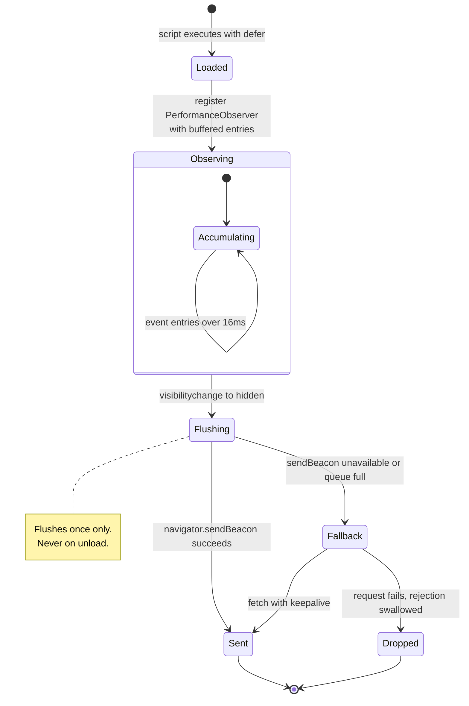

# The beacon

The client script: the metrics it collects, the accuracy of each, and the cases
it does not handle.

---

## 1. Installation

```html
<script src="https://your-vitals-host/b.js" defer></script>
```

One tag, served from the origin running `vitals`. Nothing is loaded from a CDN
or any third party.

## 2. Two files, kept in sync by hand

| File | Role |
|---|---|
| `src/internal/beacon/beacon.src.js` | Readable, commented source. This is what a reviewer reads. |
| `src/internal/beacon/beacon.min.js` | Hand-minified. This is what ships at `/b.js`. |

There is no minifier in this project, so the minified file is written by hand
from the source. Both are served: the readable version is available at
`/beacon.src.js`, and the response for `/b.js` carries an `X-Beacon-Source`
header pointing at it.

**The cost of this arrangement is real:** the two files can drift, because a
human keeps them aligned. Tests reduce but do not eliminate that risk. They
assert that every metric key, every observed entry type, and the collection
endpoint appear in both files, and that the minified file is actually minified
rather than a copy of the readable one. A real minifier would make drift
structurally impossible.

## 3. Size

| | Raw | Gzipped |
|---|---|---|
| `vitals` beacon | 942 B | 571 B |
| `web-vitals` 4.2.4 `iife` | 7,226 B | 2,601 B |
| `web-vitals` 4.2.4 `attribution.iife` | 12,505 B | 4,172 B |

All three measured by `src/tools/compare` with the same gzip implementation, because
comparing one file compressed by one implementation against another compressed
by a different one produces a difference of a few percent that is an artefact of
the tooling.

`make beacon` enforces a hard budget of 1024 raw bytes and fails the build if it
is exceeded.

To reproduce the comparison:

```bash
curl -O https://unpkg.com/web-vitals@4.2.4/dist/web-vitals.iife.js
make compare FILES="web-vitals.iife.js"
```

## 4. What is collected, and how accurate it is

| Metric | Source | Accuracy |
|---|---|---|
| TTFB | `navigation` entry, `responseStart` | Exact |
| FCP | `paint` entry, `first-contentful-paint` | Exact |
| LCP | `largest-contentful-paint`, last entry before hide | Exact as of page hide |
| CLS | `layout-shift`, session windows | Correct algorithm |
| INP | `event` entries, `durationThreshold: 16` | **Approximated** |

**CLS uses the documented session-window algorithm.** A shift joins the current
window if it falls within 1s of the previous shift and 5s of the window start;
otherwise it opens a new window. The reported value is the largest window.
Shifts with `hadRecentInput` are ignored, since a shift caused by a user
interaction is expected rather than a defect.

**INP is approximated, and the distinction is material.** Real INP tracks the
full latency of each interaction and reports a high percentile across them. This implementation
reports the **maximum duration of any single event** longer than 16ms. On a page
with few interactions the two agree closely. On a page with many, the maximum
sits above the 98th percentile that real INP reports, so the number is
pessimistic and wrong in the tail. It is labelled INP on the dashboard because
that is the metric it approximates, and the dashboard carries this correction in
its own footer.

## 5. Lifecycle and transport



The beacon accumulates values in a plain object and flushes **once**, on
`visibilitychange` when `document.visibilityState === 'hidden'`.

It does not flush on `unload`. That event is unreliable on mobile and prevents
the page from entering the back-forward cache.

Delivery is `navigator.sendBeacon`, which survives the page being torn down.
If that is unavailable or refuses, because its queue is full, it falls back to
`fetch` with `keepalive`. The rejection is swallowed deliberately: there is
nothing useful to do about a dropped sample, and an unhandled rejection would
appear in the visitor's console.

One consequence follows directly: a visitor who leaves a slow page before it
paints produces a record containing only TTFB. This is correct, as nothing else
was observed, but it means slow pages are under-represented in paint metrics.

## 6. Payload

```json
{
  "u": "/pricing",
  "t": 1756500000000,
  "w": 1440,
  "m": { "lcp": 1834.2, "cls": 0.06, "inp": 142, "ttfb": 210.5, "fcp": 903.1 }
}
```

Short keys because the payload is sent on every page view. `u` is
`location.pathname`, so query strings never leave the page. `t` is the client
clock, which the server validates but does not use for storage. `w` is
`innerWidth`, used to derive a coarse device class.

## 7. Unsupported cases

`web-vitals` handles each of the following. This implementation does not:

- **Back-forward cache restoration.** A page restored from bfcache is a new page
  view with new metrics. `web-vitals` detects the restore and re-reports; this
  beacon does not, so a back-navigation is silently missed.
- **Soft navigations.** Route changes in a single-page application produce no
  new measurements at all.
- **Prerendering.** No `activationStart` correction, so a prerendered page
  reports times measured from the wrong origin.
- **Attribution.** No indication of *which* element caused a poor LCP or a
  layout shift.
- **Older browser quirks.** Years of accumulated workarounds, particularly for
  older Safari, are absent.

Most of the size difference against `web-vitals` is these features, not padding.

## 8. The bookmarklet, for pages you do not control

The beacon is installed by a site owner. For a site that is not yours, the
dashboard offers a bookmarklet that measures a single visit.

It is a separate program from the beacon, defined as `snapshotProgram` in
`src/internal/dash/assets/dash.js` and serialised into a `javascript:` URL with
`Function.prototype.toString`. There is one copy of it, so it does not
introduce the hand-sync problem described in section 2. It observes the same
five entry types and computes CLS with the same session-window arithmetic; a
test asserts both, because a divergence would only be visible on someone
else's page.

### Why it does not simply post the payload

```mermaid
flowchart LR
  A[Bookmarklet runs on example.com] -->|POST to 127.0.0.1| B[Blocked]
  A -->|top-level navigation with the payload in the fragment| C[/snapshot.html on the vitals origin/]
  C -->|same-origin POST| D[/v1/collect]
  B -.->|Local Network Access permission denied| A
```

Chrome refuses a request from a public page to a loopback address unless the
page holds a Local Network Access permission, which it will not have:

```
Access to script at 'http://127.0.0.1:8142/snap.js' from origin
'https://www.amazon.com' has been blocked by CORS policy: Permission was
denied for this request to access the `loopback` address space.
```

A top-level navigation is not a subresource request and is not subject to that
gate. The bookmarklet therefore opens `/snapshot.html` with the payload in the
URL fragment, and that page, being on the vitals origin, performs an ordinary
same-origin POST. The fragment is never transmitted to a server by any browser,
so the measurement does not appear in an access log en route. The receiver
clears the fragment after recording, so a reload does not store it twice.

This design also means the collection endpoint needs no CORS support at all.

### What a snapshot is worth

| | |
|---|---|
| Measurement | Real. The browser's own entries for the real page load, replayed from its buffer with `buffered: true`. |
| Sample size | One visit, from your machine on your connection. Not the site's field data. |
| INP | Only interactions after the bookmarklet runs. Missing INP means unmeasured, not fast. |
| LCP | Final once the page has been interacted with, so run the bookmarklet before clicking anything. |
| Route | `host + path`, so a measured third-party page is distinguishable from your own. |

### Verification

Driven end to end in Chrome 152 against `https://www.amazon.com/`: the
bookmarklet was read from the dashboard as a user would drag it, executed in
the page, its send button clicked with a dispatched mouse event, and the
resulting record read back from the API under the route `/www.amazon.com/`.
Content Security Policy on that site logged a report-only violation for the
earlier script-loading design and does not affect the current one.

## 9. Verification status

The beacon has been driven end to end in **Chrome 152** over the DevTools
Protocol: all four demo pages loaded with no console errors, uncaught
exceptions, or failed requests; all five metrics were collected, transmitted,
stored, and rendered. INP measured 600.0ms against a handler deliberately
blocking for 600ms.

The demo pages are part of that verification: the heavy page reports an LCP in
the needs-improvement band and the blocked-interaction page a poor INP, so the
dashboard demonstrates more than one status band from real measurements.

**Firefox and Safari have not been tested.** Support there is claimed on
standards compliance, not on evidence.

Some `PerformanceObserver` entry types and `sendBeacon` behave differently on
insecure origins. `localhost` counts as a secure context, so local use works;
deploying to a plain-HTTP origin will lose metrics.
