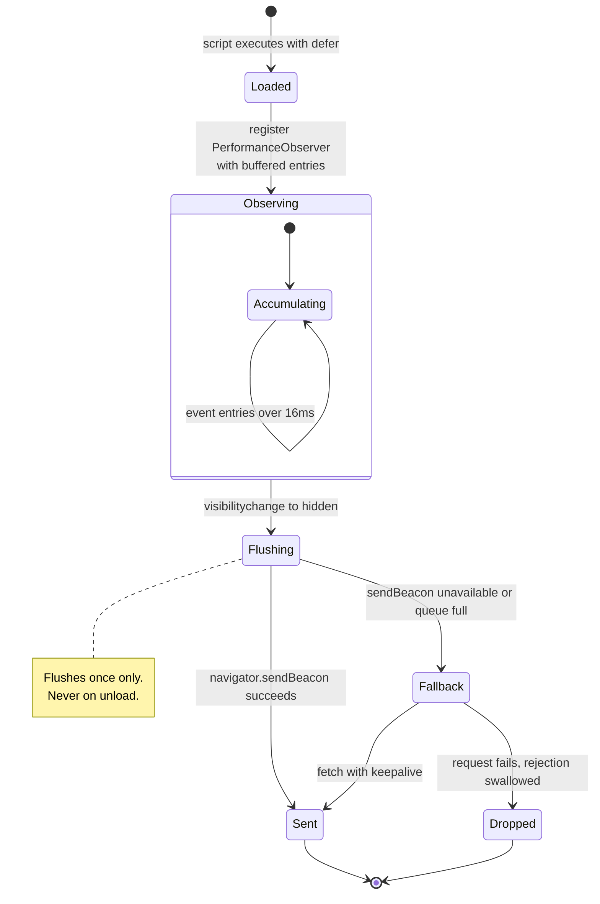

# The beacon

The client scripts: the metrics they collect, the accuracy of each, and the
cases they do not handle.

---

## 1. Installation

Two beacons are served. Pick one.

```html
<!-- 942 bytes. Page loads, approximated INP. -->
<script src="https://your-vitals-host/b.js" defer></script>

<!-- 2,656 bytes. Real INP, bfcache, soft navigations, prerender, attribution. -->
<script src="https://your-vitals-host/b-full.js" defer></script>
```

One tag, served from the origin running `vitals`. Nothing is loaded from a CDN
or any third party.

**Which to use.** `/b.js` is the default and is correct for a normal page load
on a server-rendered site: it is the smallest thing that measures Core Web
Vitals honestly. Reach for `/b-full.js` when any of these is true:

- the site is a single-page app, so most route changes are soft navigations;
- you need to know *which* element is responsible, not only that a metric is bad;
- interactions matter enough that the approximated INP is not good enough;
- the site is prerendered, or gets meaningful back-navigation traffic.

Both post to the same endpoint and are stored in the same log. A site can run
one on some pages and the other elsewhere, which is what the demo site does.

## 2. Four files, kept in sync by hand

| File | Role |
|---|---|
| `src/internal/beacon/beacon.src.js` | Readable, commented source of the default beacon. |
| `src/internal/beacon/beacon.min.js` | Hand-minified. This is what ships at `/b.js`. |
| `src/internal/beacon/beacon.full.src.js` | Readable, commented source of the full build. |
| `src/internal/beacon/beacon.full.min.js` | Hand-minified. This is what ships at `/b-full.js`. |

There is no minifier in this project, so each minified file is written by hand
from its source. All four are served: the readable versions are available at
`/beacon.src.js` and `/beacon.full.src.js`, and each script response carries an
`X-Beacon-Source` header pointing at its own.

**The cost of this arrangement is real:** the two files can drift, because a
human keeps them aligned. Tests reduce but do not eliminate that risk. They
assert that every metric key, every observed entry type, and the collection
endpoint appear in both files, and that the minified file is actually minified
rather than a copy of the readable one. A real minifier would make drift
structurally impossible.

## 3. Size

| | Raw | Gzipped |
|---|---|---|
| `vitals` beacon, `/b.js` | 942 B | 571 B |
| `vitals` full beacon, `/b-full.js` | 2,656 B | 1,415 B |
| `web-vitals` 4.2.4 `iife` | 7,226 B | 2,601 B |
| `web-vitals` 4.2.4 `attribution.iife` | 12,505 B | 4,172 B |

The honest comparison is the second row against the fourth, because that is the
pair with comparable features: 4.7x smaller raw, 2.9x gzipped. The first row
against the third is the pair a site actually chooses between by default: 7.7x
and 4.6x. Neither `web-vitals` build includes the transport; both `vitals`
builds do.

All four measured by `src/tools/compare` with the same gzip implementation, because
comparing one file compressed by one implementation against another compressed
by a different one produces a difference of a few percent that is an artefact of
the tooling.

`make beacon` enforces a hard budget on each build and fails if either is
exceeded: 1,024 raw bytes for `/b.js` and 2,816 for `/b-full.js`. They are
separate budgets on purpose. The sub-1KB claim is about the script a site puts
on every page by default; folding the full build's features into that budget
would have made the claim untrue rather than optional.

To reproduce the comparison:

```bash
curl -O https://unpkg.com/web-vitals@4.2.4/dist/web-vitals.iife.js
make compare FILES="web-vitals.iife.js"
```

## 4. What is collected, and how accurate it is

| Metric | Source | `/b.js` | `/b-full.js` |
|---|---|---|---|
| TTFB | `navigation` entry, `responseStart` | Exact | Exact, activation-corrected |
| FCP | `paint` entry, `first-contentful-paint` | Exact | Exact, activation-corrected, discarded if the page was already hidden |
| LCP | `largest-contentful-paint`, last entry before hide | Exact as of page hide | Same, with the same two corrections |
| CLS | `layout-shift`, session windows | Correct algorithm | Correct algorithm |
| INP | `event` entries | **Approximated** | Real, grouped by `interactionId` |

**CLS uses the documented session-window algorithm.** A shift joins the current
window if it falls within 1s of the previous shift and 5s of the window start;
otherwise it opens a new window. The reported value is the largest window.
Shifts with `hadRecentInput` are ignored, since a shift caused by a user
interaction is expected rather than a defect.

**INP is approximated in `/b.js`, and the distinction is material.** Real INP
tracks the full latency of each interaction and reports a high percentile across
them. The default beacon reports the **maximum duration of any single event**
longer than 16ms. On a page with few interactions the two agree closely. On a
page with many, the maximum sits above the 98th percentile that real INP
reports, so the number is pessimistic and wrong in the tail. It is labelled INP
on the dashboard because that is the metric it approximates, and the dashboard
carries this correction in its own footer.

**`/b-full.js` reports real INP.** One interaction produces several event
entries, the pointerdown, the pointerup and the click, which share an
`interactionId`. The interaction's latency is the longest of them, not their
sum. The reported value is then the interaction one place in from the top for
every 50 interactions on the page, which is the high percentile the
specification defines and what `web-vitals` reports. Two bounds remain, and both
can only under-report: only the ten longest interactions are retained, the same
number `web-vitals` keeps, so the two agree below roughly 500 interactions per
page view; and an interaction evicted from that top ten never re-enters it even
if a later event in it turns out to be slower.

**Both beacons store INP under the same key.** A window covering pages on both
beacons mixes an approximation with a real figure, and the report says so in its
caveats rather than resolving it. Resolving it would mean storing which beacon
sent each sample, which is more schema than the difference is worth.

**Attribution is best-effort.** `/b-full.js` names one element per metric: the
LCP candidate, the largest single shift inside the winning CLS window, and the
target of the interaction that set INP. A selector is a tag plus an id, or a tag
plus the first class, and never a unique path. That is the useful shape for an
aggregate, since `div#promo` counted across a thousand page views is the number
worth having, and it is a real limitation on a page built from one repeated
component: identical siblings are counted as one. `web-vitals` in its
attribution build reports considerably more, including the subpart timing
breakdown of an interaction and long-animation-frame data. This reports which
element, and nothing about why.

## 5. Lifecycle and transport



The beacon accumulates values in a plain object and flushes **once**, on
`visibilitychange` when `document.visibilityState === 'hidden'`.

It does not flush on `unload`. That event is unreliable on mobile and prevents
the page from entering the back-forward cache.

Delivery is `navigator.sendBeacon`, which survives the page being torn down.
If that is unavailable or refuses, because its queue is full, it falls back to
`fetch` with `keepalive`. The rejection is swallowed deliberately: there is
nothing useful to do about a dropped sample, and an unhandled rejection would
appear in the visitor's console.

One consequence follows directly: a visitor who leaves a slow page before it
paints produces a record containing only TTFB. This is correct, as nothing else
was observed, but it means slow pages are under-represented in paint metrics.

## 6. Payload

```json
{
  "u": "/pricing",
  "t": 1756500000000,
  "w": 1440,
  "m": { "lcp": 1834.2, "cls": 0.06, "inp": 142, "ttfb": 210.5, "fcp": 903.1 }
}
```

Short keys because the payload is sent on every page view. `u` is
`location.pathname`, so query strings never leave the page. `t` is the client
clock, which the server validates but does not use for storage. `w` is
`innerWidth`, used to derive a coarse device class.

`/b-full.js` sends three more fields:

```json
{
  "u": "/checkout",
  "t": 1756500000000,
  "w": 390,
  "i": "k3f9a1b2mfz7q",
  "n": "soft-navigation",
  "m": { "lcp": 2400, "cls": 0.21, "inp": 312 },
  "a": { "lcp": "img.hero", "cls": "div#promo", "inp": "button.add-to-cart" }
}
```

`i` identifies the page view, so a payload delivered twice is stored once. It is
not a visitor identifier: it is generated per page view from `Math.random`, is
never persisted anywhere in the browser, and cannot link two page views to each
other. `n` is how the page view began. `a` names the element blamed for each
metric.

The server treats all three as untrusted. `i` is kept only if it is lowercase
base-36 within 32 characters, `n` only if it is one of six known values, and
each `a` value is stripped of control characters, has invalid UTF-8 replaced,
and is capped at 128 bytes.

## 7. Unsupported cases

The default beacon at `/b.js` does not handle any of the following.
`/b-full.js` handles the first four; `web-vitals` handles all five.

- **Back-forward cache restoration.** A page restored from bfcache is a new page
  view with new metrics. `/b-full.js` resets its state on a `pageshow` with
  `persisted`, and reports FCP and LCP as the delay from the restore to the
  first frame after it, which approximates a paint that no browser re-fires.
- **Soft navigations.** `/b-full.js` wraps `history.pushState` and
  `history.replaceState` and listens for `popstate`, flushes the previous
  route's measurements, and starts a new page view. It does not use the
  `soft-navigation` performance entry, which is still behind a flag, so a route
  change made without the History API is missed. Only CLS and INP are meaningful
  for a soft navigation: no browser re-fires LCP or FCP for one.
- **Prerendering.** `/b-full.js` reads `activationStart` from the navigation
  entry synchronously and subtracts it from every paint timing, so a prerendered
  page is measured from activation rather than from when the browser began
  rendering it in the background.
- **A page hidden before it painted.** A page opened in a background tab still
  fires paint entries describing a frame nobody looked at. `/b-full.js` records
  when the page first became hidden and discards any FCP or LCP reported after
  it. This is the one item on the list that is a correctness bug rather than a
  missing feature, and `/b.js` still has it.
- **Older browser quirks.** Years of accumulated workarounds, particularly for
  older Safari, are absent from both builds.

Most of the size difference against `web-vitals` is these features, not padding.

### One `web-vitals` feature deliberately not implemented

`web-vitals` offers `reportAllChanges`, which calls back on every revision of a
metric rather than once at the end, along with a `delta` field carrying the
change since the previous callback. Neither beacon here has an equivalent, and
that is a decision rather than an omission.

The callback in `web-vitals` is local: reporting every change costs a function
call. Here the equivalent is a network request, so a page whose LCP is revised
eight times would post eight payloads and store eight records for one page view.
That would multiply the request volume this tool exists to keep small, and it
would break the store's assumption that one record is one page view, on which
the page-view count, the device breakdown, and every band tally depend.

`delta` follows from the same choice. With one report per page view the delta
of a metric is always the metric, so the field would carry no information.

What this costs: a page view that is abandoned before the page is hidden reports
nothing, where `reportAllChanges` would have reported the value so far. The
payload is sent on `visibilitychange` and on `pagehide`, which between them cover
every normal way a page ends, so the gap is a browser crash or a killed tab.

## 8. The bookmarklet, for pages you do not control

The beacon is installed by a site owner. For a site that is not yours, the
dashboard offers a bookmarklet that measures a single visit.

It is a separate program from the beacon, defined as `snapshotProgram` in
`src/internal/dash/assets/dash.js` and serialised into a `javascript:` URL with
`Function.prototype.toString`. There is one copy of it, so it does not
introduce the hand-sync problem described in section 2. It observes the same
five entry types and computes CLS with the same session-window arithmetic; a
test asserts both, because a divergence would only be visible on someone
else's page.

### Why it does not simply post the payload

```mermaid
flowchart LR
  A[Bookmarklet runs on example.com] -->|POST to 127.0.0.1| B[Blocked]
  A -->|top-level navigation with the payload in the fragment| C[/snapshot.html on the vitals origin/]
  C -->|same-origin POST| D[/v1/collect]
  B -.->|Local Network Access permission denied| A
```

Chrome refuses a request from a public page to a loopback address unless the
page holds a Local Network Access permission, which it will not have:

```
Access to script at 'http://127.0.0.1:8142/snap.js' from origin
'https://www.amazon.com' has been blocked by CORS policy: Permission was
denied for this request to access the `loopback` address space.
```

A top-level navigation is not a subresource request and is not subject to that
gate. The bookmarklet therefore opens `/snapshot.html` with the payload in the
URL fragment, and that page, being on the vitals origin, performs an ordinary
same-origin POST. The fragment is never transmitted to a server by any browser,
so the measurement does not appear in an access log en route. The receiver
clears the fragment after recording, so a reload does not store it twice.

This design also means the collection endpoint needs no CORS support at all.

### What a snapshot is worth

| | |
|---|---|
| Measurement | Real. The browser's own entries for the real page load, replayed from its buffer with `buffered: true`. |
| Sample size | One visit, from your machine on your connection. Not the site's field data. |
| INP | Only interactions after the bookmarklet runs. Missing INP means unmeasured, not fast. |
| LCP | Final once the page has been interacted with, so run the bookmarklet before clicking anything. |
| Route | `host + path`, so a measured third-party page is distinguishable from your own. |

### Verification

Driven end to end in Chrome 152 against `https://www.amazon.com/`: the
bookmarklet was read from the dashboard as a user would drag it, executed in
the page, its send button clicked with a dispatched mouse event, and the
resulting record read back from the API under the route `/www.amazon.com/`.
Content Security Policy on that site logged a report-only violation for the
earlier script-loading design and does not affect the current one.

## 9. Verification status

`/b.js` has been driven end to end in **Chrome 152** over the DevTools
Protocol: all four demo pages loaded with no console errors, uncaught
exceptions, or failed requests; all five metrics were collected, transmitted,
stored, and rendered. INP measured 600.0ms against a handler deliberately
blocking for 600ms.

The demo pages are part of that verification: the heavy page reports an LCP in
the needs-improvement band and the blocked-interaction page a poor INP, so the
dashboard demonstrates more than one status band from real measurements.

**`/b-full.js` has a weaker verification story, and it is worth stating
plainly.** Its syntax is checked, the server half is covered by tests from the
payload parser through to the rendered report, and a payload of the shape it
sends has been driven end to end. What has *not* happened is a browser
exercising its own collection paths: no bfcache restore, no soft navigation, no
prerendered page, and no real interaction grouped by `interactionId` has been
observed in a running browser. Those paths are written against the
specifications and reviewed, not demonstrated. Treat the four features that
distinguish it from `/b.js` as implemented and untested in the field, and prefer
`/b.js` where that distinction matters more than the features do.

**Firefox and Safari have not been tested.** Support there is claimed on
standards compliance, not on evidence.

Some `PerformanceObserver` entry types and `sendBeacon` behave differently on
insecure origins. `localhost` counts as a secure context, so local use works;
deploying to a plain-HTTP origin will lose metrics.
