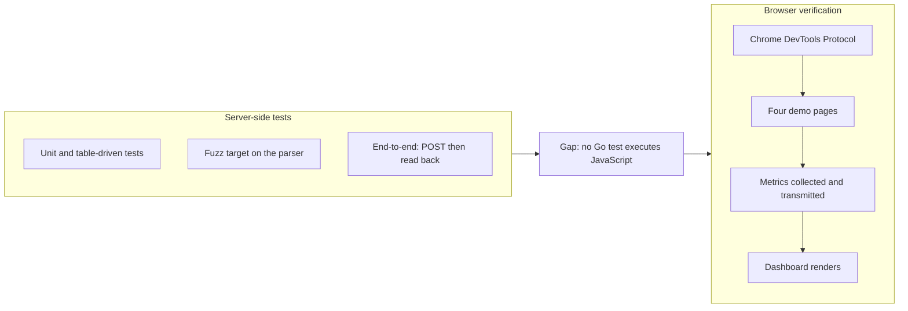

# Development

Building, testing, and the rules that constrain every change.

---

## 1. Requirements

Go 1.23 or later. Nothing else is required to build, test, or run.

`make race` additionally uses Docker, and `make compare` needs a file you have
downloaded yourself. Neither is part of the build.

## 2. Build targets

| Command | Does |
|---|---|
| `make` | Build the binary |
| `make run` | Build and serve dashboard, demo, and API on `:8080` |
| `make report` | Print the last 24 hours in the terminal |
| `make test` | Run the test suite |
| `make race` | Run the suite under the race detector, inside Docker |
| `make check` | Fail on any dependency violation |
| `make beacon` | Print the beacon size and enforce the 1KB budget |
| `make compare` | Print beacon size beside another script |
| `make proof` | Regenerate `deps-proof.txt` |
| `make repro` | Build twice and print both SHA-256 hashes |
| `make clean` | Remove build output |

## 3. Flags

| Flag | Default | Meaning |
|---|---|---|
| `-addr` | `:8080` | Listen address |
| `-data` | `data` | Directory for measurement storage |
| `-retain` | `0` | Delete day logs older than this, for example `720h`. `0` keeps everything |

### Subcommands

```bash
vitals                      # serve
vitals report               # print the last 24 hours as a table
vitals report -window 168h -p 95 -route /pricing
vitals report -json         # the document GET /api/report returns
vitals help
```

`report` opens the data directory, prints, and exits. It never listens, ingests,
or prunes, so running it against a directory a live server is writing to is
safe. It builds its document through the same code path as the API, so the two
cannot disagree.

## 4. The one rule

**This project ships with zero third-party runtime dependencies.** `go.mod` has
no `require` block. This is not a preference; it is the premise of the project,
and it is verifiable in seconds:

```bash
cat go.mod
go list -m all      # prints only: vitals
make proof          # writes deps-proof.txt
```

`golang.org/x/...` is **not** standard library and counts as a dependency.

### What `make check` enforces

`src/tools/check` walks the repository and fails the build on:

- a `require` directive in `go.mod`, including an empty block
- a `vendor` directory
- a remote `<script>` or `<link>` in any HTML file
- a remote `@import` in CSS
- a web font host, or `@font-face` fetching over the network

The check applies regular expressions to raw bytes rather than parsing, so it can
produce a false positive on prose quoting forbidden markup. This is the intended
trade: a false positive costs one code review, whereas a false negative costs the
premise of the project.

If a change appears impossible without breaking one of these rules, the correct
response is to raise it rather than to work around it silently.

## 5. Testing

Table-driven, using the standard `testing` package. There is no test framework,
which is why this project avoids the development-dependency question entirely.

| Area | What is covered |
|---|---|
| `src/internal/ingest` | Malformed input, escapes, surrogates, size limits, plus a fuzz target |
| `src/internal/stats` | Known distributions, skew, the error bound, merging, overflow |
| `src/internal/store` | Restart survival, corrupt and truncated lines, day rotation, out-of-order arrival, concurrency |
| `src/internal/httpx` | Conditional requests, gzip negotiation, MIME mapping, path traversal |
| `src/internal/dash` | Parameter parsing, every endpoint, response shapes, event broadcasting and frame quoting |
| `src/internal/beacon` | Size budget, minification, source and minified agreement |
| `src/cmd/vitals` | The report subcommand: table output, `-json`, flag validation, dispatch |
| `tests/` | Black box over HTTP: every route, JSON contracts, asset invariants, the live stream, storage and retention |

Unit tests live in the package they cover, because Go compiles a package's tests
from that package's own directory and only from there can they reach the
unexported parsers and arithmetic that carry the risk. `tests/` holds what is
visible over HTTP. [`tests/README.md`](../tests/README.md) maps each layer to
the tests that cover it.

The ingest parser has a fuzz target, since it is the only place the program
reads untrusted input:

```bash
go test ./src/internal/ingest -run=FuzzParse -fuzz=FuzzParse -fuzztime=60s
```

### JavaScript is served, never executed, by the test suite

Go tests embed and serve `dash.js`, `snapshot.js`, and the beacon. Nothing in
the suite runs them, so a syntax error passes every test and produces a blank
dashboard. Before finishing any change to an asset:

```bash
node --check src/internal/dash/assets/dash.js
node --check src/internal/dash/assets/snapshot.js
```

Node is a developer convenience here, not a dependency: nothing in the build,
the binary, or CI needs it, and loading the page in a browser proves the same
thing.

### Race detector

The race detector needs an external linker and therefore a C toolchain. Rather
than requiring one on every machine, CI runs it on Linux on every push. Locally:

```bash
make race    # borrows Linux's toolchain via Docker
```

### Browser verification



Server-side tests cannot demonstrate that the beacon functions, because no Go
test executes JavaScript. The beacon has been driven end to end in **Chrome 152** over the
DevTools Protocol, confirming that all four demo pages load without console
errors, all five metrics are collected and transmitted, and the dashboard
renders from that data.

That harness is not part of the repository. **Firefox and Safari have not been
tested.**

## 6. Continuous integration

`.github/workflows/ci.yml` runs on every push and pull request:

1. Print `go.mod` and assert `go list -m all` reports no dependencies
2. `go run ./src/tools/check .`
3. Verify `gofmt` reports nothing
4. `go vet ./...`
5. `go test ./...`
6. `go test -race ./...`
7. Build the binary
8. In a separate job: build twice and `cmp` the results

## 7. Reproducible build

```
CGO_ENABLED=0 go build -trimpath -buildvcs=false -ldflags="-s -w -buildid=" -o vitals ./src/cmd/vitals
```

Each flag removes one source of variation. `-trimpath` strips local filesystem
paths. `-buildid=` clears the build ID. **`-buildvcs=false` is the one that is
easy to miss:** since Go 1.18 the toolchain stamps `vcs.revision`, `vcs.time`,
and a module pseudo-version into any binary built inside a git repository, so
without it the output changes on every commit even when no code changed.

Verify with `go version -m vitals`, which should show no `vcs.*` entries.

Reproducibility means the same source, toolchain, and target produce the same
bytes. It does not mean one universal hash: a different Go version, GOOS, or
GOARCH produces a different and equally valid digest.

## 8. Code standards

- Idiomatic Go, as a senior reviewer would expect.
- Errors are wrapped with context and handled. Never `_ = err`.
- No `panic` in request paths.
- Exported identifiers have doc comments; every package has a package comment.
- Table-driven tests for every parser and every piece of arithmetic.
- Comments explain what the code cannot: a non-obvious decision, a stated
  limitation, a specification reference. They do not restate the code.

## 9. Frontend standards

- Vanilla HTML, CSS, and JavaScript. No framework, bundler, transpiler, or build
  step. The file a reviewer reads is the file the browser runs.
- Charts are inline SVG generated in JavaScript. No canvas, no chart library.
- System font stack only. A web font would be a third-party runtime request on a
  page arguing against third-party runtime requests.
- Accessibility floor: keyboard reachable, visible focus, `prefers-reduced-motion`
  respected, responsive to 360px, colour never the only signal.
- Each beacon has a hard raw budget, 1,024 bytes for `/b.js` and 2,816 for
  `/b-full.js`, enforced by `make beacon` and by a test.

## 10. Regenerating the demo site

The four demo pages share a navigation, head, and footer. They are generated
once by a script kept outside the repository and the output is committed, so the
HTML a reviewer reads is exactly what the browser receives. Editing the
committed HTML directly is fine; there is no build step to re-run.

## 11. Disclosure requirements

Where an implementation is approximate, it is documented in the same change that
introduces it:

- Percentiles are bucketed approximations. The error bound is stated.
- INP is approximated. What the approximation is, is stated.
- Buffered writes lose up to 2 seconds on a crash.
- Where a replaced package is better than the replacement, `STDLIB.md` says so.

No comment, document, or README statement may claim a property the code does not
have. This rule has already surfaced one genuine defect: the README asserted that
the binary contained no git SHA while the toolchain was embedding one.
