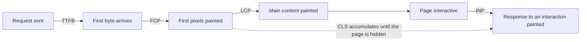
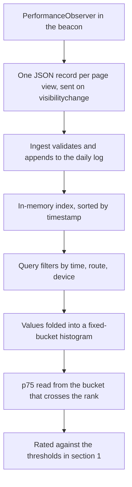

# The metrics

What each Core Web Vital measures, what a good score is, what usually causes a
bad one, and how `vitals` obtains the number. Thresholds are the published
Google values, encoded once in `src/internal/stats/metric.go` and read by both the
API and the dashboard.

---

## 1. The five at a glance

| Metric | Full name | Measures | Good | Needs improvement | Poor | Unit |
|---|---|---|---|---|---|---|
| LCP | Largest Contentful Paint | Loading: when the main content appeared | <= 2500 | <= 4000 | > 4000 | ms |
| INP | Interaction to Next Paint | Responsiveness: lag after a user acts | <= 200 | <= 500 | > 500 | ms |
| CLS | Cumulative Layout Shift | Visual stability: how much content jumped | <= 0.1 | <= 0.25 | > 0.25 | unitless |
| FCP | First Contentful Paint | When anything at all was painted | <= 1800 | <= 3000 | > 3000 | ms |
| TTFB | Time to First Byte | Server and network latency before the response | <= 800 | <= 1800 | > 1800 | ms |

LCP, INP, and CLS are the three Core Web Vitals. FCP and TTFB are diagnostic
metrics: they are not user experience scores on their own, but they explain a
bad LCP by splitting it into the part that happened before the browser had any
bytes and the part that happened after.

A metric is rated for a single page view. The dashboard reports the **75th
percentile** across the selected window, which is the percentile Google uses:
the score three quarters of your visitors did at least as well as.

---

## 2. LCP, Largest Contentful Paint

**The question it answers:** when did the page look loaded?

LCP is the render time of the largest content element visible in the viewport.
The browser revises it upward as bigger elements paint and finalises it at the
first user interaction or when the page is hidden, whichever comes first.

Only certain elements are candidates. The specification lists ``, `<image>`
inside an `<svg>`, the poster frame of a `<video>`, an element with a CSS
`background-image` loaded via `url()`, and block-level elements containing text.

**An inline `<svg>` element is not a candidate.** Neither is a `<canvas>`. A page
can spend a second rendering one and have LCP quietly report on a paragraph of
text above it. The `/demo/heavy.html` page in this repository exists partly to
demonstrate that trap.

Common causes of a bad LCP: a slow server response (visible as a bad TTFB), a
large unoptimised hero image, render-blocking CSS or synchronous JavaScript in
`<head>`, or a client-rendered page where the content element does not exist
until a framework has booted.

**How `vitals` measures it:** a `PerformanceObserver` on the
`largest-contentful-paint` entry type with `buffered: true`. The last entry seen
before the page is hidden wins. This is exact.

## 3. INP, Interaction to Next Paint

**The question it answers:** when I clicked, how long until the page reacted?

INP measures the latency of interactions across the whole page visit: the time
from a user input (click, tap, key press) until the next frame is painted
showing the result. Scrolling and hovering are not interactions. Real INP
reports a high percentile of a page's interactions, not the average and not, in
general, the single worst one.

Full interaction latency has three parts: input delay (the main thread was busy
before the handler could run), processing time (the handler itself), and
presentation delay (layout and paint of the result).

Common causes of a bad INP: long tasks blocking the main thread, an expensive
event handler, large synchronous DOM work, or a heavy re-render triggered by
every keystroke.

**How `vitals` measures it, and where the approximation is:** an observer on the
`event` entry type with `durationThreshold: 16`, keeping the **maximum single
event duration** for the page view. That is not what real INP is.

- It ignores the percentile rule, so one unlucky interaction sets the score. On
  a page with many interactions our number is pessimistic in the tail.
- The `duration` on an `event` entry is rounded to 8ms and does not decompose
  into the three phases above, so there is no attribution.
- `durationThreshold: 16` discards anything faster than one frame. None of those
  could ever be the maximum, so the filter does not change the result. It does
  mean a page whose every interaction is fast reports no INP at all rather than
  a small one.

This is the one metric here that is an approximation rather than a measurement.
It is stated on the dashboard, in the README, and in
[`docs/beacon.md`](beacon.md).

## 4. CLS, Cumulative Layout Shift

**The question it answers:** did the page move under me while I was reading it?

CLS is unitless. Each unexpected layout shift scores `impact fraction x distance
fraction`: how much of the viewport was affected, multiplied by how far it
moved. A shift within 500ms of a user interaction is expected rather than a
defect and is excluded.

Scores are grouped into **session windows**. A shift joins the current window if
it is within 1 second of the previous shift and 5 seconds of the window start.
Otherwise it opens a new window. The page's CLS is the largest window, not the
sum of every shift, which is what stops a long-lived page from accumulating an
unbounded score.

Common causes of a bad CLS: images and iframes without `width` and `height`,
ads or embeds injected above existing content, web fonts that reflow text when
they load, or content inserted at the top of the page after data arrives.

**How `vitals` measures it:** an observer on the `layout-shift` entry type,
implementing the session window rule above and reporting the largest window.
The algorithm is the specified one.

## 5. FCP, First Contentful Paint

**The question it answers:** when did the user first see anything other than a
blank page?

FCP is the time until the first text, image, non-white canvas, or SVG is
painted. It is a diagnostic metric rather than a Core Web Vital, and it is
useful mainly as the floor under LCP: LCP can never be earlier than FCP, so a
bad FCP guarantees a bad LCP and points at the load path rather than at the
hero image.

Common causes of a bad FCP: render-blocking stylesheets and scripts, a slow
server, or a font strategy that hides text until a web font downloads.

**How `vitals` measures it:** an observer on the `paint` entry type, taking the
entry named `first-contentful-paint`. This is exact.

## 6. TTFB, Time to First Byte

**The question it answers:** how much of the wait happened before the browser
had anything to work with?

TTFB is the time from the start of the navigation until the first byte of the
response arrives. It covers redirects, DNS, the TCP and TLS handshakes, and the
server's own think time.

It is diagnostic in the same way FCP is. A 3 second LCP with a 200ms TTFB is a
front-end problem. The same LCP with a 2.5 second TTFB is a back-end problem,
and no amount of image optimisation will fix it.

Common causes of a bad TTFB: slow application or database work, no caching, a
long redirect chain, or a server far from the visitor.

**How `vitals` measures it:** `responseStart` from the `navigation` entry. This
is exact.

---

## 7. Field data, not lab data

Every number here is **field data**: it comes from a real visitor's browser, on
their device and their network. That is what Real User Monitoring means, and it
is why the numbers move when your audience changes even though your code did
not.

Lab tools (Lighthouse, WebPageTest) run a synthetic load on fixed hardware. They
are reproducible and they can attribute a regression to a specific resource.
They cannot tell you that a quarter of your visitors are on a slow connection.
The two are complementary, and this project does only the first.

One consequence is worth stating: **INP and CLS need a real visit to exist.** A
page view with no interaction reports no INP, and a page with no shifts reports
no CLS. Sample counts per metric therefore differ inside the same window, which
is why every scorecard card shows its own `n`.

---

## 8. How a metric becomes a dashboard number

Percentiles are read from fixed-bucket histograms rather than from sorted
values, so they carry a bounded error: up to 4.9% relative on the millisecond
metrics and 0.0025 absolute on CLS. The arithmetic and the derivation of those
bounds are in [`docs/storage.md`](storage.md#3-percentiles).

A metric missing from a record is absent rather than zero, so it contributes
nothing to that metric's histogram and nothing to its sample count.

---

## 9. Sources

Metric definitions and thresholds follow the published Web Vitals
specifications and Google's documentation at `web.dev/vitals`. The values in
`src/internal/stats/metric.go` are the only copy in this project: the dashboard and
the API both read them from there, so a change to the standard is a one-line
change here.
