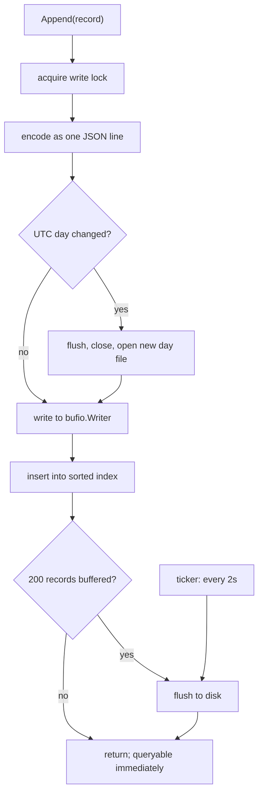
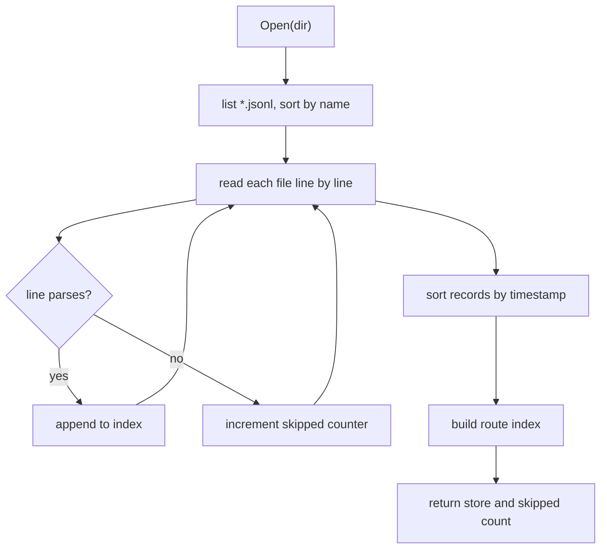

# Storage and statistics

The on-disk format, the in-memory index, and the percentile arithmetic, with
error bounds stated explicitly.

---

## 1. On-disk format

JSON Lines, one file per UTC day, in the directory given by `-data`
(default `data/`).

```
data/
  2026-08-29.jsonl
  2026-08-30.jsonl
```

One record per line:

```json
{"t":1756500000000,"u":"/pricing","s":"6dc1a67e","w":1440,"m":{"cls":0.06,"fcp":903.1,"inp":142,"lcp":1834.2,"ttfb":210.5}}
```

| Key | Meaning |
|---|---|
| `t` | Server receive time, epoch milliseconds |
| `u` | Route, query string and fragment already stripped |
| `s` | Derived session id, 8 hex characters, omitted when empty |
| `w` | Viewport width in CSS pixels, omitted when zero |
| `m` | Metric values |

Files rotate on the UTC day boundary. UTC rather than local time because local
time has daylight saving, which would make one file 23 hours long and another 25
twice a year.

The format is plain text on purpose: it can be inspected with `cat`, filtered
with `grep`, and recovered by hand if something goes wrong.

## 2. Durability



The record enters the in-memory index before it reaches disk, so a measurement
is queryable immediately while the write remains buffered.

Writes are flushed on whichever limit is reached first:

- every **200 records**, or
- every **2 seconds**.

**A crash loses up to two seconds of samples.** For performance telemetry this
is a deliberate trade rather than an oversight: the alternative is an `fsync` per
page view, which would place disk latency in the ingest path. A clean shutdown
flushes and loses nothing.

### Recovery from a partial write



File names are ISO dates, so lexical order is chronological order. A process
killed mid-write leaves a truncated final line. On startup the store
replays every log file and skips any line that fails to parse, counting them.
The count is logged:

```
vitals: replayed with 1 unreadable line(s) skipped
```

A line longer than 1MB is treated as corruption from that point in the file, and
the records already read are kept rather than discarding the whole day.

Unknown metric keys and non-finite values are dropped during replay rather than
rejecting the record, so a log written by a newer version still replays in an
older one.

## 2a. Retention and disk usage

`Store.Usage` reports what the day logs occupy, read from the files rather than
counted as bytes are written, so the figure stays true after a restart, after a
manual deletion, and after pruning. It flushes the write buffer first: without
that a store holding records could report zero bytes, which reads as a bug
rather than as buffering.

It also reports the average on-disk cost of one record, which includes the JSON
keys and not only the values. On a representative sample that is about 150 bytes
per page view, so a site serving ten thousand views a day writes roughly 1.5MB a
day.

`Store.Prune` deletes whole day logs older than a cutoff and drops their records
from memory. Two rules:

- **A file is never rewritten.** Expiry is day-granular because a partially
  rewritten append log is a corrupt append log, and the recovery story for that
  is worse than keeping a day too long.
- **The open file is never removed.** The day currently being written is skipped
  regardless of the cutoff.

The server enforces retention at startup and hourly thereafter when started with
`-retain`. Without the flag nothing is deleted. The dashboard reports the window
in its storage panel, so a missing day has a stated reason rather than looking
like data loss.

## 3. Percentiles

Percentiles are read off cumulative counts in a fixed-bucket histogram, not
computed from a sorted sample set. This is O(1) per observation with flat
memory, which is what production RUM systems do. It is also **approximate**.

### Duration metrics

Geometric buckets, so relative error is constant across the range. That is the
right shape for latency: the difference between 20ms and 25ms does not matter,
the difference between 2000ms and 2500ms does.

| Property | Value |
|---|---|
| Range | 1ms to 60,000ms |
| Growth per bucket | 10% (`ratio = 1.1`) |
| Bucket count | 118, including underflow and overflow |
| Reported value | Geometric mean of the bucket bounds |
| **Worst-case error** | **sqrt(1.1) - 1, about 4.9% relative** |

Reporting the geometric mean rather than either bound halves the worst-case
error, which would otherwise be the full 10% bucket width.

### CLS

CLS is unitless and small, so linear buckets give a flat absolute error instead
of a flat relative one.

| Property | Value |
|---|---|
| Range | 0 to 1 |
| Bucket width | 0.005 |
| Bucket count | 201, including overflow |
| Reported value | Arithmetic midpoint |
| **Worst-case error** | **0.0025 absolute** |

### Rules that constrain the reported values

**No interpolation between buckets.** Interpolating would imply a precision the
data does not have.

**Results are clamped to the observed range.** Without this, a histogram holding
a single 3ms sample would report a p75 of 3.14ms, a number no visitor
experienced.

**p0 and p100 are the true minimum and maximum,** not bucket bounds.

**The mean is exact.** Unlike the quantiles it is accumulated from raw values.

**Invalid observations are ignored.** Negative, `NaN`, and infinite values are
dropped rather than poisoning every percentile derived from them.

## 4. Banding

Values are rated against the published Core Web Vitals thresholds.

| Metric | Good | Needs improvement | Poor |
|---|---|---|---|
| LCP | ≤ 2500ms | ≤ 4000ms | > 4000ms |
| INP | ≤ 200ms | ≤ 500ms | > 500ms |
| CLS | ≤ 0.1 | ≤ 0.25 | > 0.25 |
| FCP | ≤ 1800ms | ≤ 3000ms | > 3000ms |
| TTFB | ≤ 800ms | ≤ 1800ms | > 1800ms |

LCP, INP, and CLS are the Core Web Vitals themselves, from
web.dev/articles/vitals. FCP and TTFB are Google's supplementary diagnostic
thresholds; they are not Core Web Vitals but are banded the same way here.

A metric with no threshold is rated good rather than being assigned a worse
rating that nothing measured.

## 5. In-memory index

On startup every log file is replayed into:

- a slice of records **sorted by timestamp**, and
- a map from **route to record offsets**.

Time-range queries binary-search the sorted slice. Route queries use the map, so
a query for one route out of hundreds does not scan the others.

Records usually arrive in time order, but a slow beacon can land out of order,
so an append inserts in place rather than assuming the tail. Out-of-order
arrivals rebuild the route index, which is acceptable because they are rare.

## 6. Constraints of this design

Stated explicitly, as these are the questions a reviewer should ask.

- **No compaction, no retention, no deletion.** `data/` grows forever until an
  operator prunes it.
- **Memory grows with total records.** Everything ever recorded is held in RAM.
  The tool scales to one machine and no further.
- **One writer only.** Two processes sharing a data directory will corrupt the
  log. There is no locking.
- **No indexes beyond route.** A device-class or session query scans the range.
- **No transactions, no crash-consistent guarantees** beyond skipping a
  truncated line.
- **No query planner and no query language.** The API exposes four fixed shapes.

At the scale this tool targets, one site and thousands of page views a day, an
append log plus a sorted slice is the correct engineering answer rather than a
compromise. It would not survive being pointed at a large site, and it is not
intended to.
