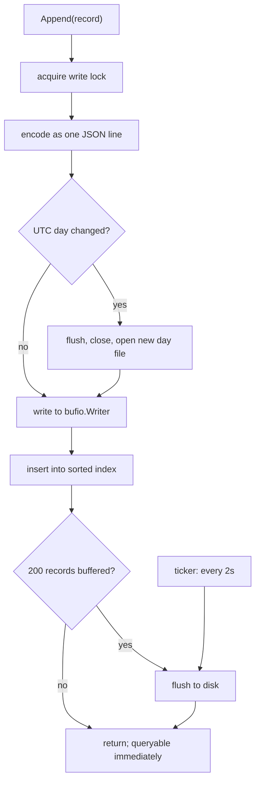
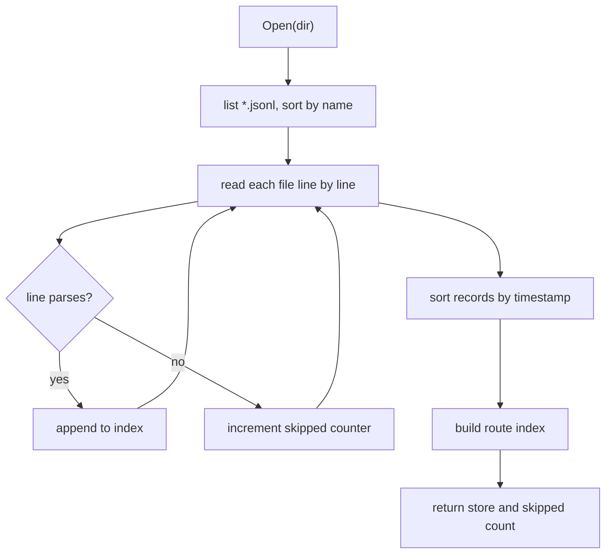

# Storage and statistics

The on-disk format, the in-memory index, and the percentile arithmetic, with
error bounds stated explicitly.

---

## 1. On-disk format

JSON Lines, one file per UTC day, in the directory given by `-data`
(default `data/`).

```
data/
  2026-08-29.jsonl
  2026-08-30.jsonl
```

One record per line:

```json
{"t":1756500000000,"u":"/pricing","s":"6dc1a67e","w":1440,"m":{"cls":0.06,"fcp":903.1,"inp":142,"lcp":1834.2,"ttfb":210.5}}
```

A record from the full beacon carries two more keys:

```json
{"t":1756500000000,"u":"/checkout","s":"6dc1a67e","w":390,"n":"soft-navigation","a":{"cls":"div#promo","lcp":"img.hero"},"m":{"cls":0.21,"lcp":2400}}
```

| Key | Meaning |
|---|---|
| `t` | Server receive time, epoch milliseconds |
| `u` | Route, query string and fragment already stripped |
| `s` | Derived session id, 8 hex characters, omitted when empty |
| `w` | Viewport width in CSS pixels, omitted when zero |
| `n` | Navigation type, omitted when the beacon reported none |
| `a` | Element blamed per metric, omitted when empty |
| `m` | Metric values |

`n` and `a` are omitted rather than written empty, so a site running only the
942-byte beacon writes exactly the lines it wrote before this field existed and
pays nothing for a feature it is not using. The format is forward and backward
compatible in both directions: an old line replays into the current binary with
those fields absent, and a line carrying them replays into an older binary,
which ignores unknown keys.

The page-view identifier the full beacon sends is **not** stored. It exists only
to drop a payload delivered twice, duplicates arrive within seconds of each
other, and the deduplication set lives in memory and is discarded on restart.
Writing it to disk would add a per-record cost for a value nothing reads back.

Files rotate on the UTC day boundary. UTC rather than local time because local
time has daylight saving, which would make one file 23 hours long and another 25
twice a year.

The format is plain text on purpose: it can be inspected with `cat`, filtered
with `grep`, and recovered by hand if something goes wrong.

## 2. Durability



The record enters the in-memory index before it reaches disk, so a measurement
is queryable immediately while the write remains buffered.

Writes are flushed on whichever limit is reached first:

- every **200 records**, or
- every **2 seconds**.

**A crash loses up to two seconds of samples.** For performance telemetry this
is a deliberate trade rather than an oversight: the alternative is an `fsync` per
page view, which would place disk latency in the ingest path. A clean shutdown
flushes and loses nothing.

### Recovery from a partial write



File names are ISO dates, so lexical order is chronological order. A process
killed mid-write leaves a truncated final line. On startup the store
replays every log file and skips any line that fails to parse, counting them.
The count is logged:

```
vitals: replayed with 1 unreadable line(s) skipped
```

A line longer than 1MB is treated as corruption from that point in the file, and
the records already read are kept rather than discarding the whole day.

Unknown metric keys and non-finite values are dropped during replay rather than
rejecting the record, so a log written by a newer version still replays in an
older one.

## 2a. Retention and disk usage

`Store.Usage` reports what the day logs occupy, read from the files rather than
counted as bytes are written, so the figure stays true after a restart, after a
manual deletion, and after pruning. It flushes the write buffer first: without
that a store holding records could report zero bytes, which reads as a bug
rather than as buffering.

It also reports the average on-disk cost of one record, which includes the JSON
keys and not only the values. On a representative sample that is about 150 bytes
per page view, so a site serving ten thousand views a day writes roughly 1.5MB a
day.

`Store.Prune` deletes whole day logs older than a cutoff and drops their records
from memory. Two rules:

- **A file is never rewritten.** Expiry is day-granular because a partially
  rewritten append log is a corrupt append log, and the recovery story for that
  is worse than keeping a day too long.
- **The open file is never removed.** The day currently being written is skipped
  regardless of the cutoff.

The server enforces retention at startup and hourly thereafter when started with
`-retain`. Without the flag nothing is deleted. The dashboard reports the window
in its storage panel, so a missing day has a stated reason rather than looking
like data loss.

## 2b. Measured cost

Every figure below comes from `go test ./src/internal/store/ -bench . -benchmem
-run '^$'` on an Intel i5-6300U, Go 1.26, Windows. They are here because the
scale limit further down is a claim, and a claim about performance without a
number is an opinion.

| Operation | Cost | Notes |
|---|---|---|
| Append, in order | **8.7 us** | Marshal, buffered write, index update. Never waits on disk |
| Append, out of order | **66 us** | Worst case: inserted at the front of 5,000 records |
| Full index rebuild | **0.7 to 1.0 ms** | What an out-of-order append used to cost, at the same size |
| Scan a 100,000-record window | **1.19 ms** | Zero allocations |
| Scan one route through the index | **49 us** | Zero allocations |
| Scan one visitor's journey | **2.5 us** | Zero allocations |
| Rank visitors by recency | **89 us** | Walks the session index, not the records |
| Encode one record | **2.6 us** | `encoding/json`, 794 B |
| Decode one record | **5.0 us** | 23 MB/s |
| Replay 100,000 records | **593 ms** | 20 MB/s, 164 MB allocated |

Three things follow from this table, and all three are load-bearing.

**The append path is not quadratic, and it used to be.** An out-of-order arrival
once rebuilt both secondary indexes, the millisecond row. That is not a rare path:
the collector stamps a record with the wall clock and then takes the store lock
separately, so two concurrent page views regularly land in the opposite order to
their timestamps. Shifting the indexes instead is the 66 us row, and the gap
between the two grows linearly with the number of records held.

**Startup is the real scale limit, and decoding dominates it.** Replaying
100,000 records takes 593 ms, and 100,000 decodes at 5.0 us each accounts for
about 500 ms of that. So a directory of a million records takes roughly six
seconds to open and allocates about 1.6 GB along the way. That is tolerable for
one site and it is the number that says why: it is the cost of `encoding/json`
on the read path, not of the index or the file layout.

**It is also the case for the binary segment format that was cut.** A packed
record with a fixed layout would not be parsed at all, only copied, which would
remove essentially all of that 500 ms. That is the honest size of what cutting
it gave up. See the end of this document.

## 3. Percentiles

Percentiles are read off cumulative counts in a fixed-bucket histogram, not
computed from a sorted sample set. This is O(1) per observation with flat
memory, which is what production RUM systems do. It is also **approximate**.

### Duration metrics

Geometric buckets, so relative error is constant across the range. That is the
right shape for latency: the difference between 20ms and 25ms does not matter,
the difference between 2000ms and 2500ms does.

| Property | Value |
|---|---|
| Range | 1ms to 60,000ms |
| Growth per bucket | 10% (`ratio = 1.1`) |
| Bucket count | 118, including underflow and overflow |
| Reported value | Geometric mean of the bucket bounds |
| **Worst-case error** | **sqrt(1.1) - 1, about 4.9% relative** |

Reporting the geometric mean rather than either bound halves the worst-case
error, which would otherwise be the full 10% bucket width.

### CLS

CLS is unitless and small, so linear buckets give a flat absolute error instead
of a flat relative one.

| Property | Value |
|---|---|
| Range | 0 to 1 |
| Bucket width | 0.005 |
| Bucket count | 201, including overflow |
| Reported value | Arithmetic midpoint |
| **Worst-case error** | **0.0025 absolute** |

### Rules that constrain the reported values

**No interpolation between buckets.** Interpolating would imply a precision the
data does not have.

**Results are clamped to the observed range.** Without this, a histogram holding
a single 3ms sample would report a p75 of 3.14ms, a number no visitor
experienced.

**p0 and p100 are the true minimum and maximum,** not bucket bounds.

**The mean is exact.** Unlike the quantiles it is accumulated from raw values.

**Invalid observations are ignored.** Negative, `NaN`, and infinite values are
dropped rather than poisoning every percentile derived from them.

## 4. Banding

Values are rated against the published Core Web Vitals thresholds.

| Metric | Good | Needs improvement | Poor |
|---|---|---|---|
| LCP | ≤ 2500ms | ≤ 4000ms | > 4000ms |
| INP | ≤ 200ms | ≤ 500ms | > 500ms |
| CLS | ≤ 0.1 | ≤ 0.25 | > 0.25 |
| FCP | ≤ 1800ms | ≤ 3000ms | > 3000ms |
| TTFB | ≤ 800ms | ≤ 1800ms | > 1800ms |

LCP, INP, and CLS are the Core Web Vitals themselves, from
web.dev/articles/vitals. FCP and TTFB are Google's supplementary diagnostic
thresholds; they are not Core Web Vitals but are banded the same way here.

A metric with no threshold is rated good rather than being assigned a worse
rating that nothing measured.

## 5. In-memory index

On startup every log file is replayed into:

- a slice of records **sorted by timestamp**, and
- a map from **route to record offsets**.

Time-range queries binary-search the sorted slice. Route queries use the map, so
a query for one route out of hundreds does not scan the others.

Records usually arrive in time order, but a slow beacon can land out of order,
so an append inserts in place rather than assuming the tail. Out-of-order
arrivals rebuild the route index, which is acceptable because they are rare.

## 6. Constraints of this design

Stated explicitly, as these are the questions a reviewer should ask.

- **No compaction.** Day logs are never rewritten or merged. Retention deletes
  whole files; without `-retain`, `data/` grows forever.
- **Memory grows with total records.** Everything ever recorded is held in RAM.
  The tool scales to one machine and no further.
- **One writer only.** Two processes sharing a data directory will corrupt the
  log. There is no locking.
- **No indexes beyond route.** A device-class or session query scans the range.
- **No transactions, no crash-consistent guarantees** beyond skipping a
  truncated line.
- **No query planner and no query language.** The API exposes five fixed shapes.
- **JSONL rather than a binary segment format.** This was planned and cut on
  purpose; see below.

At the scale this tool targets, one site and thousands of page views a day, an
append log plus a sorted slice is the correct engineering answer rather than a
compromise. It would not survive being pointed at a large site, and it is not
intended to.

### The binary segment format that is not here

The design called for compacting sealed day logs into a hand-written binary
format: a fixed record layout, a magic header, and a CRC per segment, with the
reader accepting both formats so old data stayed readable. That would have
removed `encoding/json` from the write path entirely and cut the per-record
cost by roughly half.

It was cut deliberately, ahead of the deadline rather than discovered missing at
it. A new on-disk format is the one change in this project capable of losing
data silently, and shipping one without time to exercise it against truncation,
partial writes, and mixed-format replay would trade a durability story that is
tested for one that is merely written.

The measured cost of not doing it is about 150 bytes per record instead of an
estimated 40 to 60, and a JSON parse per record at startup rather than a
fixed-width read. The dashboard reports the real figure from the files, so the
size of the tradeoff is visible rather than asserted.
